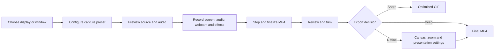
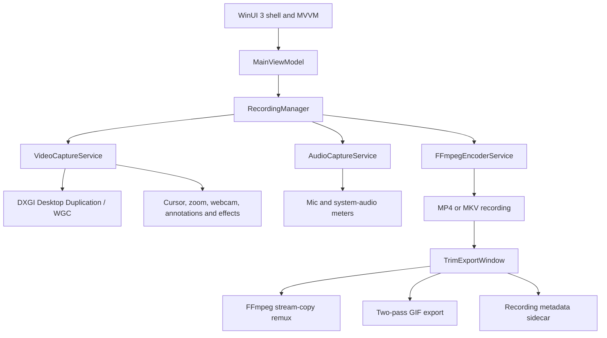
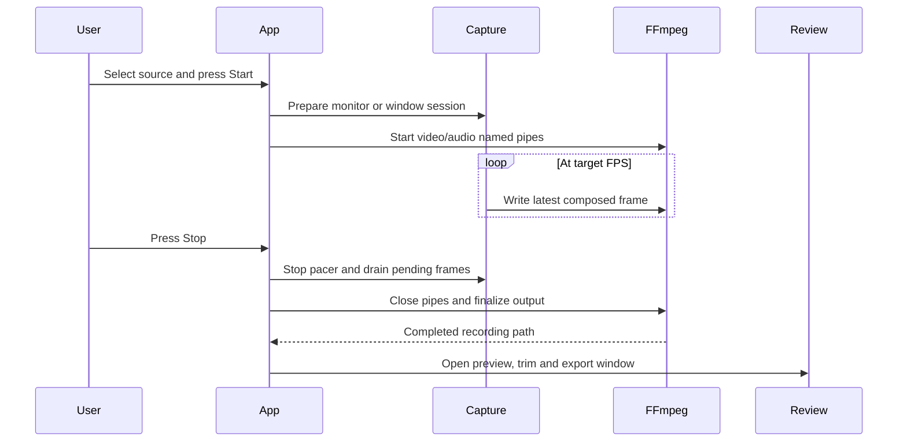

<div align="center">


# Cap-IT Screen Recorder

**A premium, GPU-accelerated Windows screen recorder that does the boring parts of making a great
tutorial for you** — pick what to record from live thumbnails, let smart zoom follow what you're
actually doing, draw on your screen while you talk, clean up your mic, and export a trimmed GIF, all
without leaving the app.

[](../../releases/latest)
[](../../releases)
[](#-installation)
[](#%EF%B8%8F-tech-stack)
[](#%EF%B8%8F-tech-stack)
[](#%EF%B8%8F-tech-stack)

### [**⬇ Download the latest Windows installer**](../../releases/latest)

[What's new](#-whats-new-in-v322) · [Features](#-features) · [Screenshots](#-screenshots) · [Install](#-installation) · [Shortcuts](#%EF%B8%8F-keyboard-shortcuts) · [Architecture](#-architecture) · [Build from source](#-building-from-source)

<br/>


</div>

---

## ℹ️ Overview

Cap-IT Screen Recorder is a native, self-contained Windows 10/11 desktop application for creating
clear software tutorials, product demos, bug reports, presentations, and vertical social clips.
It combines GPU-assisted capture, live interaction effects, audio monitoring, webcam picture-in-picture,
post-recording composition, and export in one focused workflow — without a browser tab or cloud upload.

### Product workflow



### At a glance

| Capability | Included |
|---|---|
| Capture targets | Full monitor, individual window, live source-picker thumbnails |
| Output | MP4 or MKV, 360p–4K, 15/24/30/60 FPS |
| Encoders | NVIDIA NVENC, AMD AMF, Intel QSV, software H.264 fallback |
| Audio | System audio, microphone, live meters, Studio Mic cleanup |
| Visual effects | Smart zoom, cursor spotlight, click ripples, keystrokes, webcam PiP |
| Annotations | Pen, line, arrow, rectangle, ellipse, text, undo, clear, fade modes |
| Post-production | Preview, trim, zoom regions, canvas composition, MP4 and two-pass GIF export |
| Deployment | Self-contained Windows installer; no separate .NET or Windows App SDK runtime |

### ✍️ Author

Designed and developed by **[Chamath Dilshan](https://github.com/ChamathDilshanC)**.

---

## 🆕 What's new in v3.2.2

This release improves the post-recording experience and makes stopping a recording resilient:

| | |
|---|---|
| ✅ **Reliable stop flow** | A review-window initialization error can no longer close the application after a successful recording. The MP4 remains finalized and saved even if the editor cannot be opened. |
| ▶️ **Stable Review & Export window** | The review window is retained by the application for its full lifetime, so video preview, canvas controls, trim range, MP4 save, GIF export, and discard actions remain available after stopping. |
| 🖼️ **Safer presentation metadata** | Missing or incomplete background-mode values in older recording metadata are handled safely instead of breaking the preview canvas. |
| 🎥 **Current recording editor** | Review recordings with a MediaPlayer preview, trim timeline, post-record zoom regions, canvas presets, backgrounds, rounded corners, shadows, device frames, watermarks, cursor metadata, and GIF export. |

> **Upgrade note:** recordings and preferences are preserved. Settings remain outside the install directory at `%LocalAppData%\Cap-IT Screen Recorder\settings.json`, and recording metadata is stored beside each video.

---

## 🆕 What's new in v2.7.0

A performance release. The capture pipeline moved onto the GPU, the encoder stopped being able to drag
the recording out of sync, and the colours are finally tagged correctly.

| | |
|---|---|
| 🚀 **The whole frame pipeline runs on the GPU** | Cursor, smart zoom, sharpening, click ripples, spotlight and the webcam/keystroke overlays are now shader passes on the frame the capture API already handed us on the GPU, instead of vector code walking 8MB of system memory. Monitor capture only for now — single-window capture keeps the CPU path. |
| 🎨 **1.5 bytes per pixel to the encoder, not 4** | The colour conversion FFmpeg used to redo on every single frame now happens on the GPU as the last step before the frame comes back, so what crosses the pipe is 4:2:0 rather than raw BGRA — **62% less data**, and FFmpeg's conversion pass disappears rather than moving somewhere else. |
| ⚡ **~3× faster zoom, even without a GPU** | The CPU kernels were rewritten too, so machines that fall back still gain: the resampler's per-pixel bookkeeping is hoisted into a table computed once per frame, the arithmetic is SIMD, and the alpha channel is no longer computed just to be discarded. A zoomed 1080p frame went from **40.2ms to 12.5ms** — the difference between not holding 30fps and fitting inside a 60fps budget. |
| ⏱️ **A recording that stays in sync** | The frame pacer used to do the pipe write itself, so any time FFmpeg stalled — a keyframe, a disk flush, a slow preset at 4K — the tick was simply missed. Because the encoder is fed at a fixed rate, a missed tick is not a late frame, it is a frame that never exists: the video came out short while the audio, which never stalls, did not. Writing now happens on its own thread, and a slow encoder costs a repeated frame instead of drifting the timeline. |
| 🎯 **60fps that is actually 60fps** | Windows' default timer granularity is ~15.6ms, so a 16.67ms pacer was really getting 15.6 and 31.2 alternating — a ±50% error on every frame interval, visible as uneven motion even though the file's framerate was exactly right. The recorder now raises the timer resolution for the duration of a recording, and drops it again afterwards so it costs nothing on battery. |
| 🌈 **Correct colour, finally** | Recordings are now converted **and tagged** BT.709. Every previous release converted as BT.601 and tagged the file with nothing at all, so players fell back to guessing from the frame size and decoded HD footage as 709 — a real, if mild, hue and saturation error that had been there the whole time. |
| 🧹 **No more allocation churn in window capture** | Single-window recording allocated two full frames per frame — about **1GB/s** onto the Large Object Heap at 1080p, with the GC pauses that implies. Both buffers are now reused. |

> **Recordings will look slightly different** — very slightly. The colour fix above changes hue and
> saturation by a small amount on every recording made from this version on. It is a correction, not a
> regression: what you get now is what your screen actually looked like.

Your saved settings are **not** affected by updating. They live in
`%LocalAppData%\Cap-IT Screen Recorder\settings.json`, outside the install folder — an in-place
upgrade only overwrites the program files and never runs the uninstaller.

### Recording scenes / presets

The Home tab includes one-click built-in presets for **Tutorial, Coding, Presentation, Gaming, Bug
Report, and Vertical Reel**. A preset changes capture quality (resolution and FPS), zoom, cursor,
webcam, audio, and annotation options together; your selected display, window, microphone, and webcam
devices are preserved. Enter a name and choose **Save** to create a custom preset. Saving an existing
custom name overwrites it, and **Delete** removes it. Custom presets are stored alongside the other
preferences in `%LocalAppData%\Cap-IT Screen Recorder\settings.json`.

### Post-record cursor editor

After recording, the Review & Export window retains cursor presentation metadata and exposes controls
for style, size, smoothing, hide-when-idle, click emphasis, and a cursor trail. The settings are saved
next to the recording as `<recording>.<extension>.metadata.json` and are carried into MP4 export
metadata; GIF exports receive the same sidecar metadata. Older recordings without a sidecar continue
to open and export normally.

The current capture engine composites the cursor into each video frame rather than retaining a separate
vector cursor track. Consequently, changing these controls after recording updates the retained
manifest/export metadata, but cannot redraw the already-rasterized cursor in the preview or pixels.
New capture-time rendering controls can be added later without changing the sidecar format.

### Canvas / Presentation mode

Review & Export includes presentation controls for 16:9, 9:16, 1:1, and 4:5 canvases. Recordings can
be placed in a floating frame with configurable padding, rounded corners, shadow, and an optional
device-frame outline. Backgrounds support an image, a solid colour, or a two-colour gradient. An
optional watermark/logo can be composited in the lower-right corner. These settings are saved in the
recording metadata sidecar and are applied consistently to MP4 and GIF exports; trim ranges and
post-record zoom regions remain relative to the original recording timeline.

Cursor settings remain metadata-only because the cursor is rasterized into the captured frames.
Very large source recordings, unusual FFmpeg builds without the `gradients` filter, or watermark files
removed before export may require falling back to an image/solid background.

<details>
<summary><strong>What it actually measures — and where it still does not fit</strong></summary>

<br/>

Every kernel that moved to the GPU was held against the CPU one it replaced, pixel for pixel, across
zoom levels from 1.2× to 3×: the largest disagreement anywhere is **2 of 255** on any colour channel,
which is float-versus-double rounding, not a visible difference. The colour conversion was separately
checked against FFmpeg's own BT.709 output (largest luma difference: **1**) and then end to end, by
encoding real captured frames and decoding them back.

Timings on the development machine, for a zoomed frame including the read back to system memory:

| | GPU | CPU |
|---|---|---|
| 720p | 2.7–3.0 ms | 6.1–8.5 ms |
| 1080p | 5.3–7.2 ms | 9.4–11.3 ms |
| 4K | 20.5–24.6 ms | 33.5–36.3 ms |

The CPU column **excludes** the frame download it also has to pay, so the real gap is wider than it
looks. 1080p60 now sits comfortably inside its 16.67ms budget. **4K60 with the zoom active still does
not fit** — it got about 1.5× faster, not free. The remaining cost is dominated by reading the frame
back across the bus, which is bandwidth-bound; encoding directly from the GPU texture is what would
actually close that gap.

Where a GPU cannot run the pipeline — an unsupported driver, a shader that will not compile, odd
capture dimensions — the recorder silently uses the CPU path instead. A GPU that cannot do this means
a slower recording, never a failed one.

</details>

---

<details>
<summary><strong>Previously, in v2.6.2</strong></summary>

<br/>

### v2.6.2

The zoom no longer freezes mid-move, and zoomed footage looks far sharper.

| | |
|---|---|
| 🎬 **The zoom stops sticking** | The easing was advancing only when the *screen* changed. Screen capture delivers a frame when something moves — but the moments the camera most needs to keep animating (holding after a click, easing back out) are exactly the moments nothing is moving, so the zoom froze mid-push and then lurched. The capture loop now has its own ~60Hz heartbeat and re-composes the last frame, so the move plays out smoothly over a completely still screen. |
| 🔍 **Much sharper zoomed image** | Zoomed frames get an unsharp-mask pass tuned for screen content, ramped by how far in the camera actually is so it fades in and out with the move. Text and UI edges regain most of the crispness the upscale costs. |
| ⚡ **No allocation churn on the hot path** | The capture and compose buffers are reused and swapped rather than reallocated per frame — at 1080p each is 8MB, i.e. Large Object Heap, and now that frames are composed on a timer too, per-frame allocation would have meant GC pauses showing up as the very stutter this release removes. Idle CPU actually went *down*. |
| ▶️ **Recordings play in Windows' own players again** | "Maximize text clarity" used to encode 4:4:4 chroma, which **Windows' built-in H.264 decoder cannot read** — those recordings failed with *"Video could not be decoded"* in the review window, in Movies & TV and in Photos, and opened only in VLC. Everything now encodes 4:2:0 High profile, which plays everywhere. |
| ✨ **...and that setting keeps its sharpness** | It now spends its budget on a slower preset, a lower CRF and a **chroma bitrate boost** — the last one targeting exactly the colored-text fringing 4:4:4 was there to fix, without leaving a decodable profile. |
| 💬 **A real message when preview fails** | If a recording can't be previewed, the window now says *why*, and says plainly when the file itself is fine — instead of a bare decoder error that looks like a lost take. |
| 🔒 **Settings survive an interrupted save** | `settings.json` is now written atomically with a rolling `.bak`. A save interrupted at the wrong moment (the updater closing the app, a power cut) can no longer leave a half-written file that reads as "no settings" and resets every preference. |

> **Already have a 4:4:4 recording?** It isn't damaged. Play it in VLC, or convert it with
> `ffmpeg -i input.mp4 -c:v libx264 -pix_fmt yuv420p -crf 16 -c:a copy output.mp4`.

Your saved settings are **not** affected by updating. They live in
`%LocalAppData%\Cap-IT Screen Recorder\settings.json`, outside the install folder — an in-place
upgrade only overwrites the program files and never runs the uninstaller.

<details>
<summary><strong>Why zoomed footage can never be as sharp as 1x — and what this actually fixes</strong></summary>

<br/>

Smart zoom is **digital** zoom. On a 1080p display at 150%, the region you are zoomed into only ever
contained 1280×720 real pixels, and it is being shown at 1920×1080. A third of the linear resolution
is simply not in the source, and no resampling kernel can invent it — that is why zoomed passages read
as soft next to the razor-sharp 1x frames around them.

Sharpening does not bring that detail back either. What it does is restore **local edge contrast**,
which is what the eye actually reads as sharpness, and on screen content — hard edges between flat
colors — it recovers most of the perceived crispness. The mask is radius-1 (a 1-2-1 binomial blur),
deliberately the narrowest possible: a wider radius is what produces the bright rims around text that
make sharpened recordings look artificial.

If you want zoomed footage that is **genuinely** 1:1 sharp, give the crop somewhere to land: record at
your native resolution but set **Resolution** on the Capture tab below it, so the zoomed crop is
downscaled into the output rather than upscaled. At 1.5x zoom on a 1080p screen, a 720p output is an
exact pixel-for-pixel match. A lower zoom level costs less detail for the same reason.

</details>

<details>
<summary><strong>What the smoothness costs</strong></summary>

<br/>

Animating at ~60Hz instead of "whenever the screen happened to change" means roughly 3× as many frames
get composed while the camera is moving, and each one is a full-frame resample. Measured on a 1080p
desktop, CPU during a move went from ~25% to ~75% of all cores — for the ~0.5–0.75s the move lasts.
Once the springs settle the work stops entirely (the crop is no longer changing, so re-composing would
produce an identical frame), and fully idle sits at **0.7%**, below the 1.3% the previous release used.

If a spike ever does starve the encoder, it degrades gracefully: the pacer re-sends the last frame
rather than dropping or corrupting anything. Making the resample separable would roughly halve the
per-frame cost and is the obvious next step if this proves tight on slower machines.

</details>

</details>

<details>
<summary><strong>Previously, in v2.6.0</strong></summary>

<br/>

### v2.6.0

The smart zoom now moves like a real camera — and you can make it fire on clicks only.

| | |
|---|---|
| 🎥 **Ultra-smooth, After Effects-style zoom** | The camera now eases in **and** out on a critically damped spring instead of a first-order lag. It accelerates smoothly rather than lurching to full speed the instant you move, decelerates into its target, and never overshoots or bounces. |
| 🖱️ **Zoom on click only** | A new toggle on **Smart Tracking**: with it on, nothing but a mouse click pushes the camera in — moving the mouse or typing leaves you at full desktop. Holds for about 2.5s after the click so the result is on screen, then eases back out. |
| 🎯 **Steadier framing** | A pan dead zone means hand tremor and pixel-level cursor jitter no longer drive a permanent low-amplitude wobble at 2x. The camera holds genuinely still until the cursor actually goes somewhere. |

Both are live — you can flip the trigger mode in the middle of a recording and the camera eases
between the two behaviours rather than cutting.

<details>
<summary><strong>Why a spring instead of the old ease</strong></summary>

<br/>

The previous easing was a first-order lag: `value += (target - value) * alpha`. Its velocity is at
maximum the instant the target changes and only decays from there — a smooth stop, but a hard start.
That asymmetry is exactly what made the motion read as mechanical.

A **critically damped spring** carries velocity as state, so it is C1-continuous through a target
change: it accelerates and decelerates smoothly, which is the shape of an After Effects Easy Ease.
Critically damped specifically (damping ratio exactly 1) is the fastest approach that still cannot
overshoot — an underdamped spring would sail past the cursor and swing back, which on a screen
recording reads as the camera wobbling.

The integration is the closed-form solution of the spring over the frame's elapsed time (the Game
Programming Gems 4 approximation, the same one Unity's `Mathf.SmoothDamp` uses), so it is
unconditionally stable at any frame interval — unlike a naive Euler integration, which matters on a
capture thread whose timing is not guaranteed. Push-in runs at a 0.50s smooth time, the release at
0.75s, and the lateral pan at 0.32s: a camera that lands a touch quicker than it lets go reads as
intentional rather than rubber-banded.

Click-only mode takes its trigger from the low-level hook's button-down signal rather than the
general "a click happened" event, which also covers the mouse wheel — scrolling should not push the
camera in.

</details>

---

</details>

<details>
<summary><strong>Previously, in v2.5.0</strong></summary>

<br/>

### v2.5.0

Audio sources you can change mid-take, and the installed version on screen.

| | |
|---|---|
| 🎙️ **Switch audio sources while recording** | **Record system audio**, **Record microphone** and the **microphone device** can now be changed in the middle of a recording. Turn your mic on halfway through, drop system sound before a noisy bit, swap headsets — no stopping, no second file. |
| 🔢 **Version on the Home tab** | The installed release version now shows under *Developed by Chamath Dilshan*, so you can tell at a glance which build you're on. |

Everything on the **Capture** tab that FFmpeg is handed once at start — capture target, frame rate,
encoder, bitrate, quality and output format — is still fixed for the length of a recording, because a
single MP4 can't change resolution or frame rate partway through. The Capture tab now says so while
you're recording, instead of just greying out.

<details>
<summary><strong>How the audio sources come and go mid-stream</strong></summary>

<br/>

Both sources already fed a single NAudio `MixingSampleProvider` behind one FFmpeg audio pipe. The
mixer is now built from the target wave format rather than from a fixed source list, which keeps it
valid with **zero** inputs — so a source can be added or removed at any time, and with `ReadFully`
set it hands back silence rather than stalling when nothing is attached. FFmpeg keeps receiving a
continuous audio stream either way, so the timeline never drifts.

Opening and closing a WASAPI device can't happen on the UI thread (that's what used to freeze the app
when the mic device changed), so each change is applied on a background thread with a short debounce
— the same pattern the live level meters already use.

Two cases still can't take a live change, and the Audio tab now explains rather than just disabling:
a recording **started with no audio at all** has no FFmpeg audio stream to feed, and the **Studio Mic
noise suppression** path puts each source on its own FFmpeg input inside a fixed `amix` filter graph
that can't lose a leg mid-stream.

</details>

</details>

---

## ✨ Features

### 🎥 Capture, sharply

- **Visual source picker** — a gallery of live thumbnails for every display and window; selecting a tile immediately drives the Home live preview, and **Select** commits it (or **Select and record** starts recording in one step)
- **GPU-accelerated monitor capture** via the DXGI Desktop Duplication API — no screen-scraping, no per-frame WinRT overhead
- **Single-window capture** via Windows Graphics Capture, with overlapping windows correctly excluded — record one app even while other things sit on top of it
- **Catmull-Rom Smart Animated Zoom** — eases into your chosen zoom level only while you're actively moving the mouse, clicking, or typing, on a critically damped spring that accelerates and settles smoothly with no overshoot (an After Effects-style Easy Ease, not a snap or a lurch). Pans to the real text caret while you type instead of a stale mouse position, holds steady through cursor jitter via a pan dead zone, and can be set to fire on **mouse clicks only**. Resamples with a 16-tap Catmull-Rom kernel — sharper than bilinear, with none of the haloing a naive sharpen filter adds on top of text
- **Text Clarity mode** — an opt-in encode path that spends extra bitrate on fine detail and on the chroma planes (a lower CRF, a slower preset and a negative chroma QP offset), cutting the color bleed 4:2:0 subsampling causes around anti-aliased text while staying High profile 4:2:0 so the result plays in every player
- **Content-adaptive encoding** on every encoder (CRF for libx264, quality-target VBR for NVENC/AMF/QSV) — bits go where the frame needs them, with your bitrate as a hard ceiling
- 360p up to 4K output, 15/24/30/60 fps, automatic hardware encoder selection (NVIDIA NVENC / AMD AMF / Intel QSV / software x264) with fallback

### 🖊️ Live on-screen creativity

- **Live annotations with a real toolbar** — draw over your desktop while recording, on a genuinely transparent, always-on-top, click-through overlay. **Pen, Line, Arrow, Rectangle, Ellipse and a click-to-type Text tool**, with colours, thickness, undo and clear on a draggable floating palette that is hidden from the recording itself. New freehand strokes can snap to clean lines, rectangles, ellipses, and arrows, and annotations can be set to remain **Persistent** or fade after **3, 5, or 10 seconds**. Toggle drawing with **Ctrl+Shift+D** from anywhere, undo with **Ctrl+Shift+Z**, clear with **Esc**
- **Circular webcam PiP** — a round, always-on-top picture-in-picture webcam overlay, composited straight into the recording
- **Cursor spotlight** — dims everything except a soft-edged circle around the pointer, with a radius you can adjust live, even while recording
- **Click ripples** — a brief expanding ring on every click, left or right
- **Keystroke overlay** — recent keystrokes fade in and out on screen as you type

### 🎙️ Audio that doesn't sound like a screen recording

- **System audio + microphone**, mixed to one clean AAC track
- **Live level meters** — segmented, dBFS-scaled meters for both mic and system audio, so you can confirm you're actually being heard *before* you hit record, not after
- **Studio Mic (AI-level noise suppression)** — an FFmpeg `highpass` + `adeclick` + adaptive `afftdn` chain scrubs hum, fan noise, and keyboard clicks from your voice, applied *only* to the mic signal (via a dual-pipe FFmpeg pipeline) so it never touches your system or game audio

### ✂️ Post-production, without leaving the app

- **Quick trim & review** — the moment you stop, a review window opens with a scrubbable preview and a dual-thumb trim range
- **Post-recording camera control** — add retained manual zoom regions in the review timeline, enable/disable them, move their start/end handles, and edit focus and scale. Regions are saved beside the recording (`.zoom.json`) and are applied to MP4 and GIF exports after the live smart-zoom pass, so existing automatic zoom remains intact
- **High-quality GIF export** — a proper two-pass `palettegen`/`paletteuse` pipeline (not a naive single-pass conversion), with live progress, so shareable GIFs look like the source instead of banded and dithered
- Keep the full MP4, export a trimmed GIF, or discard the take — all from the same screen

### 🧭 A UI that stays out of your way

- **Eight-tab NavigationView shell** — Home, Capture, Smart Tracking, Webcam, Annotations, Effects, Audio, Settings; each a focused, card-based Fluent Design page
- **Live preview** of exactly what's being captured, from the moment a source is selected — not just while recording; picker tiles and the Capture-tab dropdowns both update it, while window capture remains window-only
- **Light, Dark, or System default theme** — choose the app theme on the Settings tab; the selection is saved in `%LocalAppData%\Cap-IT Screen Recorder\settings.json` and applied to the whole window
- **Pause / resume, two ways** — **Pause Video** stops the recording outright (the file gets no longer while you're paused), **Pause Screen** freezes just the picture while your voice and the timeline keep running
- **Live settings** — cursor style, smart zoom (including its **click-only** trigger mode), keystroke overlay, click ripples, spotlight, the webcam PiP **and your audio sources** can all be changed mid-recording
- **In-app updates** — checks GitHub Releases on startup and can download and install a new version in place
- **FFmpeg auto-setup** — if `ffmpeg.exe` isn't found, Start Recording offers to fetch it with a live progress bar instead of failing

---

## 📸 Screenshots

<div align="center">

### Choose what to record — from live thumbnails


<sub>Every tile updates live. Windows are rendered with <code>PrintWindow</code>, so even a fully covered window previews correctly.</sub>

<br/><br/>

### Draw on your screen while you record


<sub>The overlay is a real, transparent desktop window — so whatever you draw is captured automatically, with no extra compositing. Note the annotations appearing inside the app's own live preview.</sub>

<br/><br/>

### Recording, with live audio metering


</div>

<br/>

<div align="center">
<table>
<tr>
<td align="center" width="50%"><br/><sub><b>Capture</b> — source, frame rate, encoder, quality, cursor</sub></td>
<td align="center" width="50%"><br/><sub><b>Audio</b> — sources, device, live meters, Studio Mic</sub></td>
</tr>
<tr>
<td align="center" width="50%"><br/><sub><b>Smart Tracking</b> — interaction-triggered zoom & keystroke overlay</sub></td>
<td align="center" width="50%"><br/><sub><b>Effects</b> — cursor spotlight (live radius) & click ripples</sub></td>
</tr>
<tr>
<td align="center" width="50%"><br/><sub><b>Annotations</b> — hotkeys, pen color, stroke thickness</sub></td>
<td align="center" width="50%"><br/><sub><b>Webcam</b> — circular picture-in-picture overlay</sub></td>
</tr>
<tr>
<td align="center" width="50%"><br/><sub><b>Review & Export</b> — trim range, keep MP4, or export GIF</sub></td>
<td align="center" width="50%"><br/><sub><b>Settings</b> — output folder and general preferences</sub></td>
</tr>
</table>
</div>

---

## 📦 Installation

Grab **`CapIT-Screen-Recorder-Setup-3.2.2.exe`** from
**[Releases](../../releases/latest)** and run it. It's a normal Windows installer (built with Inno
Setup) and it's fully self-contained — no separate .NET runtime, no Windows App SDK runtime, and no
manual FFmpeg download.

<div align="center">
<table>
<tr>
<td align="center" width="33%"><br/><sub>1. Choose install mode</sub></td>
<td align="center" width="33%"><br/><sub>2. Choose destination folder</sub></td>
<td align="center" width="33%"><br/><sub>3. Optional desktop shortcut</sub></td>
</tr>
<tr>
<td align="center" width="33%"><br/><sub>4. Confirm and install</sub></td>
<td align="center" width="33%"><br/><sub>5. Installing</sub></td>
<td align="center" width="33%"><br/><sub>6. Done — launch it</sub></td>
</tr>
</table>
</div>

Cap-IT is added to the Start Menu (and Add/Remove Programs for a clean uninstall), with an optional
desktop shortcut. Uninstalling asks whether to also remove your saved settings; **your recordings are
never touched**.

> **Requirements:** Windows 10 version 2004 (build 19041) or later, 64-bit. Windows 11 recommended.

### Updating

Cap-IT checks GitHub Releases once on startup. When a newer version exists you'll get an
**Update available** banner — *Update now* downloads that release's installer, runs it silently over
your existing install, and relaunches the app. Nothing else to do.

---

## 🚀 Quick start

1. **Pick a source.** Hit **Choose source** on the Home tab and click a display or window tile — every
   tile is live, and the Home preview updates as you browse. Press **Select** to keep the source, or
   cancel to restore the previous preview. The same preview behavior applies to the source dropdowns
   on the Capture tab.
2. **Check your audio.** The meters next to the timer should move when you speak or play something. If
   one says *unavailable*, pick a different device on the **Audio** tab.
3. **Turn on what you need.** Smart zoom (**Smart Tracking**), webcam PiP (**Webcam**), spotlight and
   click ripples (**Effects**), on-screen drawing (**Annotations**).
4. **Record.** Press **Start Recording** — or use **Select and record** straight from the picker.
5. **Review.** Stopping opens the review window: trim the range, then **Keep MP4**, **Export GIF**, or
   **Discard**.
6. **Choose a theme.** Open **Settings → Appearance → Theme** and select **Light**, **Dark**, or
   **System default**. The choice applies immediately and persists across launches.

---

## ⌨️ Keyboard shortcuts

These are global — they work anywhere on the desktop, with no need to focus Cap-IT. They're live
whenever **Annotations** is switched on.

| Shortcut | Action |
|---|---|
| <kbd>Ctrl</kbd> + <kbd>Shift</kbd> + <kbd>D</kbd> | Toggle drawing mode on/off |
| <kbd>Ctrl</kbd> + <kbd>Shift</kbd> + <kbd>Z</kbd> | Undo the last stroke |
| Hold <kbd>Shift</kbd> while drawing | Snap rectangles/circles to equal dimensions; freehand shapes become perfect squares/circles |
| Hold <kbd>Alt</kbd> while drawing | Resize a shape from its center |
| <kbd>Ctrl</kbd> + <kbd>D</kbd> | Duplicate the selected annotation |
| <kbd>Esc</kbd> | Clear all drawings |

While drawing mode is **on**, the overlay captures your clicks. Toggle it back off to interact with
the apps underneath — anything you've drawn stays on screen.

---

## 🧭 Architecture

Cap-IT keeps capture, encoding, monitoring, and post-production separate so a slow encoder or
optional effect does not have to block the UI.



### Recording lifecycle



---

## 🛠️ Tech Stack

- **C# / .NET 8**, **WinUI 3** (Windows App SDK), MVVM (`CommunityToolkit.Mvvm`)
- **DXGI Desktop Duplication** (`Vortice.Direct3D11` / `Vortice.DXGI`) for GPU-accelerated full-monitor capture, and **Windows Graphics Capture (WGC)** for single-window capture
- **NAudio** — WASAPI loopback + microphone capture, kept on independent pipes when Studio Mic noise suppression is active so FFmpeg's filters only ever touch the mic signal
- **FFmpeg** (bundled, auto-downloadable on first run) — H.264/AAC encoding and MP4/MKV muxing fed over named pipes for live recording, a two-pass `palettegen`/`paletteuse` pipeline for GIF export, and duration probing for the trim range
- **GDI / GDI+** — `PrintWindow` + `StretchBlt` for the source picker's live thumbnails, and `UpdateLayeredWindow` for the per-pixel-alpha annotation overlay
- **`CommunityToolkit.WinUI.Controls`** — `SettingsCard`/`SettingsExpander` throughout, `RangeSelector` for the trim range
- `MediaPlayerElement` for the post-recording review window
- Raw Win32 interop (`SetWindowsHookEx`, `WS_EX_TRANSPARENT`, layered windows) for the global hotkeys and the click-through overlay
- Unpackaged, self-contained deployment; an [Inno Setup](https://jrsoftware.org/isinfo.php) script builds the Windows installer on top of it

---

## 🗂️ Project layout

```
Views/                  MainWindow, ShellPage (8-tab NavigationView shell), HomePage, CapturePage,
                        TrackingPage, WebcamPage, AnnotationsPage, EffectsPage, AudioPage,
                        SettingsPage, SourcePickerDialog (live-thumbnail source gallery),
                        TrimExportWindow (post-recording review / trim / GIF export)
└── Controls/           LevelMeter (segmented audio level meter)
ViewModels/             BaseViewModel, MainViewModel, CaptureSourceItem (one picker tile)
Models/                 AppSettings, RecordingSettings (+ option-pair records: ResolutionOption,
                        CursorStyleOption, ZoomLevelOption, AnnotationColorOption), MonitorInfo,
                        WindowInfo, CaptureTargetKind, RecordingState
Services/
├── Capture/            VideoCaptureService (DXGI Desktop Duplication + WGC window capture, cursor
│                       rendering, smart zoom, spotlight/click-ripple/keystroke compositing, webcam
│                       PiP), AudioCaptureService, SourceThumbnailService (picker thumbnails),
│                       Mic/SpeakerLevelMonitorService (live meters), device enumerators
│   └── Interop/        Win32 P/Invokes (monitor/window enumeration, window styles, cursor position)
├── Encoding/           FFmpegEncoderService (process + named pipes, dual-leg filter_complex for mic
│                       noise suppression), FFmpegLocator, FFmpegDownloader, MediaDurationProbe
├── Export/             GifExportService (two-pass palettegen/paletteuse, progress parsing)
├── Overlay/            AnnotationOverlayService, AnnotationOverlayWindow (Win32 layered
│                       per-pixel-alpha drawing overlay)
├── Tracking/           GlobalKeyboardHook, GlobalMouseHook, GlobalHotkeyHook
├── RecordingManager.cs Orchestrates capture + encoder + audio into record/pause/stop
├── SettingsService.cs  JSON preferences under %LocalAppData%
└── UpdateService.cs    GitHub Releases update check + in-place installer handoff
ffmpeg/                 Bundled encoder binary goes here (see ffmpeg/README.md)
Installer/              Inno Setup script that packages the published output
app.manifest            DPI awareness, OS compatibility
```

---

## 🔨 Building from source

Requires the **Windows 10/11 SDK** and **MSBuild** (Visual Studio, or the standalone Build Tools) in
addition to the .NET 8 SDK — WinUI 3 projects need the platform toolset, not just `dotnet`. You'll
also need `ffmpeg.exe` in `ffmpeg\` — see [ffmpeg/README.md](ffmpeg/README.md).

```powershell
dotnet restore
dotnet build -c Debug
.\bin\Debug\net8.0-windows10.0.19041.0\win-x64\ScreenRecorderApp.exe
```

### Publishing a standalone build

```powershell
dotnet publish ScreenRecorderApp.csproj -c Release -r win-x64 --self-contained true -o publish
```

`publish\` is fully self-contained (the .NET runtime, the Windows App SDK runtime, and
`ffmpeg\ffmpeg.exe` are all included, as long as `ffmpeg\ffmpeg.exe` existed locally *before* you ran
this). Copy it to any Windows 10/11 x64 machine and run `ScreenRecorderApp.exe` directly. This is also
the folder the installer packages.

### Building the installer

```powershell
& "$env:LOCALAPPDATA\Programs\Inno Setup 6\ISCC.exe" Installer\CapITScreenRecorder.iss
```

Install [Inno Setup 6](https://jrsoftware.org/isdl.php) first (`winget install -e --id JRSoftware.InnoSetup`),
and publish before compiling so `publish\` is current. The installer lands in
`Installer\Output\CapIT-Screen-Recorder-Setup-<version>.exe`.

### Cutting a release

The in-app updater reads GitHub Releases, so each release needs:

1. The version bumped in **two** places, kept in lockstep — `<Version>` in `ScreenRecorderApp.csproj`
   (the app reads this back at runtime to compare) and `MyAppVersion` in
   `Installer\CapITScreenRecorder.iss`.
2. A publish, then an installer build.
3. A GitHub Release tagged `vX.Y.Z` with `CapIT-Screen-Recorder-Setup-X.Y.Z.exe` attached.

Draft and pre-release releases are ignored by the updater.

---

## ⚙️ How recording works

1. `VideoCaptureService.Prepare()` sets up either a DXGI Desktop Duplication session (display capture)
   or a Windows Graphics Capture session (window capture) on the chosen target, resolving the real
   capture resolution without starting frame delivery yet. Which one it builds is decided solely by the
   capture-target kind the user selected.
2. `FFmpegEncoderService.StartAsync()` spawns `ffmpeg.exe` and waits for it to connect to the **video**
   named pipe only.
3. `VideoCaptureService.BeginCapture()` starts a dedicated capture thread that copies each frame into a
   shared buffer and composites in the cursor overlay, smart zoom, spotlight, click ripples, keystroke
   overlay, and webcam PiP. A pacing loop writes the most recent frame to the pipe on every tick at the
   target FPS, decoupling event-driven capture from FFmpeg's fixed-rate `rawvideo` input and
   duplicating the last frame when nothing changed (or while paused) so output stays in sync with real
   elapsed time.
4. Once real frame bytes are flowing, the **audio** pipe is connected (FFmpeg won't probe a second
   input until the first has data). With Studio Mic active and both sources enabled, a *third* pipe is
   connected the same way and FFmpeg's `-filter_complex` applies `highpass`/`adeclick`/`afftdn` to the
   mic leg alone before `amix` merges it with untouched system audio.
5. `AudioCaptureService` mixes (or, in the dual-pipe case, keeps separate) WASAPI loopback +
   microphone into 48 kHz stereo PCM16.
6. If annotations are enabled, a transparent, click-through, always-on-top layered overlay sits over
   the display. Because it's a real desktop window with genuine per-pixel alpha, Desktop Duplication
   captures your strokes as part of the normal desktop composition — and captures the desktop *through*
   the parts you haven't drawn on.
7. On stop, the pipes close and `q` goes to FFmpeg's stdin so it finalizes cleanly. Output uses
   fragmented MP4 rather than `+faststart`, so there's no expensive rewrite-the-whole-file step and the
   file stays valid even under a forced shutdown. The review window then opens to trim, export, or
   discard.

## 🔍 How the smart zoom & text clarity work

Zoom and the "sharp text" work both happen frame-by-frame in `VideoCaptureService`, on the same raw
BGRA buffer the cursor overlay is composited into — not with FFmpeg filters, since a live `zoompan`
can't practically be steered by an external, constantly-changing cursor/caret signal.

- **Activity tracking** — mouse movement comes from the capture API's own per-frame pointer position;
  clicks from a `WH_MOUSE_LL` hook; typing from a `WH_KEYBOARD_LL` hook. Whichever fired most recently
  decides the pan target, and typing looks up the real text caret via `GetGUIThreadInfo` rather than
  the last mouse position. **Zoom on click only** narrows the trigger to the hook's button-down signal
  alone — not the wheel, and not movement or typing — and holds the zoom for a longer 2.5s, since what
  a click zoom is there to show happens *after* the click.
- **Easing** — zoom factor and both pan axes advance along a **critically damped spring**, integrated
  with the closed-form solution over the frame's real elapsed time, so the trajectory is identical
  regardless of the capture thread's variable frame timing (and a dropped frame changes nothing). A
  spring carries velocity as state, which is what gives the motion a soft start as well as a soft stop;
  critical damping is the fastest approach that still cannot overshoot into a wobble. Push-in 0.50s,
  release 0.75s, lateral pan 0.32s.
- **Dead zone** — the camera aims at an anchor the cursor only drags once it leaves a box around it
  (12% of the zoomed crop). Feeding the raw cursor into the spring instead would let every hand tremor
  through as a small impulse, which at 2x is a visible permanent wobble.
- **Animation clock** — the easing advances on the capture loop's own ~60Hz heartbeat, not on screen
  changes. DXGI only yields a frame when the desktop actually changes, so tying the springs to frame
  arrival froze the camera mid-move over a still screen; the loop now re-composes the last raw frame
  while a move is in flight, and stops entirely once the springs settle (an unchanged crop over an
  unchanged screen would just reproduce the same bytes).
- **Sharpening** — a radius-1 unsharp mask after the upscale, ramped by how far past 1x the camera is
  so it eases in with the move. Digital zoom throws away real resolution that nothing can recover;
  restoring local edge contrast is what makes what is left read as sharp.
- **Resampling** — the zoomed crop is resampled with a 16-tap separable **Catmull-Rom** kernel
  (Mitchell–Netravali B=0, C=0.5). Bilinear's positive-only weights are exactly what softens edges;
  Catmull-Rom's small negative lobes recover that lost contrast, which is what keeps zoomed text
  legible, at roughly 4× bilinear's per-pixel cost.
- **Encoding** — every encoder uses content-adaptive rate control capped by your bitrate as
  `-maxrate`/`-bufsize`, so detailed regions get more bits automatically. "Maximize text clarity"
  additionally drops libx264 to `-crf 15` at `-preset medium` with `chroma-qp-offset=-2`, which spends
  the extra bits on the chroma planes where colored-text fringing actually comes from — opt-in, since
  it costs meaningfully more bitrate and only applies to libx264.

  Everything stays **High profile 4:2:0**. Through v2.6.0 this path used `yuv444p`/`high444` instead,
  which was sharper but undecodable by Media Foundation — so those recordings would not play in the
  app's own review window, in Movies & TV or in Photos, only in ffmpeg-based players like VLC. Trading
  a file's playability for chroma resolution is the wrong trade for a screen recorder, so 4:4:4 is
  gone.

---

## 🧪 Notable fixes along the way

**Intermittent crash after a few seconds of recording.** Early builds used `Windows.Graphics.Capture`
through hand-written WinRT interop and would reliably crash with `AccessViolationException` inside
`WinRT.IObjectReference.Finalize()` — a native/managed-boundary crash on the GC finalizer thread that
no managed handler can catch. Fixed by rewriting monitor capture on DXGI Desktop Duplication, which is
plain COM with no WinRT projection, eliminating the entire class of crash. WGC was later reintroduced
scoped strictly to window capture, where Desktop Duplication has no equivalent.

**"Item is unplayable" in VLC on large recordings.** MP4s used `-movflags +faststart`, which rewrites
the entire file on stop; for a long, high-bitrate recording that rewrite could outlast the shutdown
grace period, and a forced kill mid-rewrite left a file with no moov atom at all. Fixed with fragmented
MP4, written incrementally as recording progresses.

**Cursor overlay not appearing.** DXGI's `PointerPosition` is only valid on the frame where the cursor
actually changed; on every other frame it's zeroed rather than repeated. The fix retains the last known
position instead of overwriting it with stale zeros.

**Webcam PiP lag and dropout on monitor switch.** An early compositing pass re-decoded and re-scaled the
circular overlay every frame, and tore the camera down whenever the video capture target changed. Fixed
by decoupling webcam lifecycle from video-capture lifecycle entirely.

**GIFs looking dithered and banded.** A single-pass MP4→GIF conversion falls back to a generic fixed
256-color palette. Fixed with the standard two-pass approach — `palettegen` builds an optimal palette
for the exact trimmed clip, then `paletteuse` dithers onto it.

**And the two fixed in v2.3.0 / v2.4.0** — "Video could not be decoded" in the review window (Media
Foundation can't decode the fragmented MP4 the app records for crash-safety; recordings are now
remuxed to a standard MP4 on stop), and a Pause that never actually shortened the file.
[Full write-up above.](#-whats-new-in-v250)

---

## 💭 Feedback and contributing

Found a bug, have an idea, or want to improve Cap-IT?

- [Open an issue](../../issues/new/choose) for reproducible bugs and feature requests.
- Include your Windows version, Cap-IT version, capture target, encoder, and steps to reproduce.
- Attach the relevant `crash.log` or a short screen recording when it does not contain private data.
- For code changes, keep the existing WinUI/MVVM patterns, update related documentation, and run
  `dotnet build ScreenRecorderApp.csproj --no-restore` before opening a pull request.
- Use [GitHub Discussions](../../discussions) for questions, workflow ideas, and broader design feedback.

---

## 📄 License & credits

Cap-IT Screen Recorder — designed and developed by **[Chamath Dilshan](https://github.com/ChamathDilshanC)**.

Bundles [FFmpeg](https://ffmpeg.org/) (LGPL/GPL, depending on build) for encoding and export. Built on
the [Windows App SDK](https://github.com/microsoft/WindowsAppSDK),
[NAudio](https://github.com/naudio/NAudio), [Vortice.Windows](https://github.com/amerkoleci/Vortice.Windows),
and the [.NET Community Toolkit](https://github.com/CommunityToolkit).

<div align="center">
<br/>

**[⬇ Download the latest release](../../releases/latest)** &nbsp;·&nbsp; [Report an issue](../../issues)

<sub>If Cap-IT is useful to you, a ⭐ on the repo is genuinely appreciated.</sub>

</div>
