<div align="center">


# Cap-IT Screen Recorder

**A premium, GPU-accelerated Windows screen recorder that does the boring parts of making a great
tutorial for you** — pick what to record from live thumbnails, let smart zoom follow what you're
actually doing, draw on your screen while you talk, clean up your mic, and export a trimmed GIF, all
without leaving the app.

[](../../releases/latest)
[](../../releases)
[](#-installation)
[](#%EF%B8%8F-tech-stack)
[](#%EF%B8%8F-tech-stack)
[](#%EF%B8%8F-tech-stack)

### [**⬇ Download for Windows**](../../releases/latest)

[What's new](#-whats-new-in-v240) · [Features](#-features) · [Screenshots](#-screenshots) · [Install](#-installation) · [Shortcuts](#%EF%B8%8F-keyboard-shortcuts) · [Build from source](#-building-from-source)

<br/>

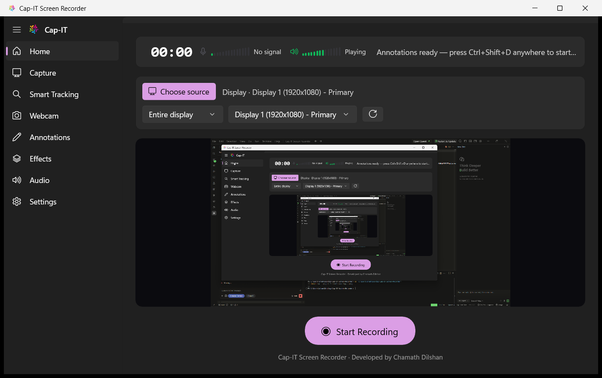

</div>

---

## 🆕 What's new in v2.4.0

A proper drawing toolbar for teaching, settings you can change mid-take, and a Pause that actually
pauses.

| | |
|---|---|
| 🧰 **Annotation toolbar — shapes and text** | Drawing Mode now puts a floating palette on screen: **Pen, Line, Arrow, Rectangle, Ellipse** and a click-to-type **Text** tool, plus the six colours, three thickness presets, undo and clear. Drag it anywhere. It's flagged `WDA_EXCLUDEFROMCAPTURE`, so **the toolbar never appears in the recording** — only what you draw with it does. |
| ⚙️ **Change settings while you're recording** | Cursor style, smart zoom and its level, the keystroke overlay, click ripples, the spotlight, and the webcam PiP can all be switched on, off, or adjusted **mid-recording** — they're composited per frame, so they take effect on the next one. No stopping, no restart. |
| ⏸️ **Pause actually shortens the recording** | Pausing used to keep feeding the encoder a frozen frame and silence, so a 4-second take paused for 5 seconds came out **9 seconds long** — and disagreed with the on-screen timer. Both the video pacer and the audio pump now stop writing entirely while paused. |

<details>
<summary><strong>What was wrong with Pause, and how the toolbar stays out of your video</strong></summary>

<br/>

**Pause never paused the file.** The frame pacer skipped *fetching* a new frame while paused but still
wrote the last one to FFmpeg on every tick, and the audio pump zero-filled its buffer and wrote that —
so the encoder received a full second of video and audio for every real second of a pause. The elapsed
timer, which correctly excludes paused time, therefore disagreed with the file it produced. Both now
skip the write outright, so the output timeline stops with the timer and the two streams resume in
step. The audio pump still *reads* and discards while paused, so the 2-second capture buffer can't fill
up and replay stale audio the moment you resume.

**The toolbar is a second window on purpose.** Annotations have to be captured — that's the whole
point, they're drawn onto the desktop the recorder is duplicating. A palette drawn onto that same
surface would be captured too. So the palette is its own layered window with
`SetWindowDisplayAffinity(WDA_EXCLUDEFROMCAPTURE)`, which DXGI Desktop Duplication and Windows
Graphics Capture both honour: visible on your screen, absent from the recording and the live preview.

**Typing doesn't leak.** The overlay is `WS_EX_NOACTIVATE` and never takes keyboard focus, so the text
tool's keystrokes come from the low-level hook that already handles the annotation hotkeys. While a
label is being typed the hook returns non-zero for printable keys, Backspace, Enter and Esc, so they
land in the annotation instead of the app underneath.

</details>

---

## ✨ Features

### 🎥 Capture, sharply

- **Visual source picker** — a gallery of live thumbnails for every display and window; pick by sight, then **Select and record** in one step
- **GPU-accelerated monitor capture** via the DXGI Desktop Duplication API — no screen-scraping, no per-frame WinRT overhead
- **Single-window capture** via Windows Graphics Capture, with overlapping windows correctly excluded — record one app even while other things sit on top of it
- **Catmull-Rom Smart Animated Zoom** — eases into your chosen zoom level only while you're actively moving the mouse, clicking, or typing (a proper time-constant ease, not a snap), pans to the real text caret while you type instead of a stale mouse position, and resamples with a 16-tap Catmull-Rom kernel — sharper than bilinear, with none of the haloing a naive sharpen filter adds on top of text
- **4:4:4 Chroma Text Clarity mode** — an opt-in `yuv444p`/`high444` encode path that removes the color bleed 4:2:0 chroma subsampling causes around anti-aliased text
- **Content-adaptive encoding** on every encoder (CRF for libx264, quality-target VBR for NVENC/AMF/QSV) — bits go where the frame needs them, with your bitrate as a hard ceiling
- 360p up to 4K output, 15/24/30/60 fps, automatic hardware encoder selection (NVIDIA NVENC / AMD AMF / Intel QSV / software x264) with fallback

### 🖊️ Live on-screen creativity

- **Live annotations with a real toolbar** — draw over your desktop while recording, on a genuinely transparent, always-on-top, click-through overlay. **Pen, Line, Arrow, Rectangle, Ellipse and a click-to-type Text tool**, with colours, thickness, undo and clear on a draggable floating palette that is hidden from the recording itself. Toggle drawing with **Ctrl+Shift+D** from anywhere, undo with **Ctrl+Shift+Z**, clear with **Esc**
- **Circular webcam PiP** — a round, always-on-top picture-in-picture webcam overlay, composited straight into the recording
- **Cursor spotlight** — dims everything except a soft-edged circle around the pointer, with a radius you can adjust live, even while recording
- **Click ripples** — a brief expanding ring on every click, left or right
- **Keystroke overlay** — recent keystrokes fade in and out on screen as you type

### 🎙️ Audio that doesn't sound like a screen recording

- **System audio + microphone**, mixed to one clean AAC track
- **Live level meters** — segmented, dBFS-scaled meters for both mic and system audio, so you can confirm you're actually being heard *before* you hit record, not after
- **Studio Mic (AI-level noise suppression)** — an FFmpeg `highpass` + `adeclick` + adaptive `afftdn` chain scrubs hum, fan noise, and keyboard clicks from your voice, applied *only* to the mic signal (via a dual-pipe FFmpeg pipeline) so it never touches your system or game audio

### ✂️ Post-production, without leaving the app

- **Quick trim & review** — the moment you stop, a review window opens with a scrubbable preview and a dual-thumb trim range
- **High-quality GIF export** — a proper two-pass `palettegen`/`paletteuse` pipeline (not a naive single-pass conversion), with live progress, so shareable GIFs look like the source instead of banded and dithered
- Keep the full MP4, export a trimmed GIF, or discard the take — all from the same screen

### 🧭 A UI that stays out of your way

- **Eight-tab NavigationView shell** — Home, Capture, Smart Tracking, Webcam, Annotations, Effects, Audio, Settings; each a focused, card-based Fluent Design page
- **Live preview** of exactly what's being captured, from the moment a source is selected — not just while recording
- **Pause / resume, two ways** — **Pause Video** stops the recording outright (the file gets no longer while you're paused), **Pause Screen** freezes just the picture while your voice and the timeline keep running
- **Live settings** — cursor style, smart zoom, keystroke overlay, click ripples, spotlight and the webcam PiP can all be changed mid-recording
- **In-app updates** — checks GitHub Releases on startup and can download and install a new version in place
- **FFmpeg auto-setup** — if `ffmpeg.exe` isn't found, Start Recording offers to fetch it with a live progress bar instead of failing

---

## 📸 Screenshots

<div align="center">

### Choose what to record — from live thumbnails

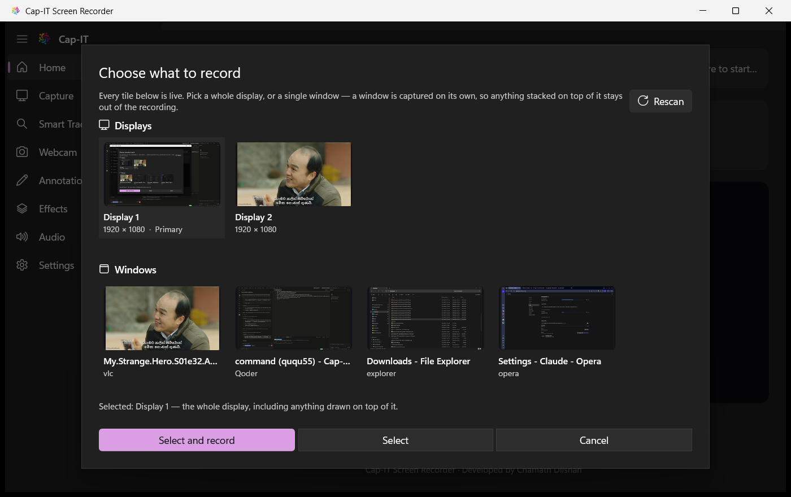

<sub>Every tile updates live. Windows are rendered with <code>PrintWindow</code>, so even a fully covered window previews correctly.</sub>

<br/><br/>

### Draw on your screen while you record

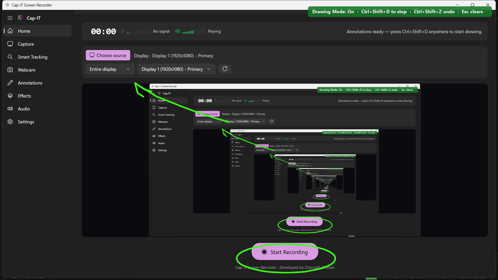

<sub>The overlay is a real, transparent desktop window — so whatever you draw is captured automatically, with no extra compositing. Note the annotations appearing inside the app's own live preview.</sub>

<br/><br/>

### Recording, with live audio metering

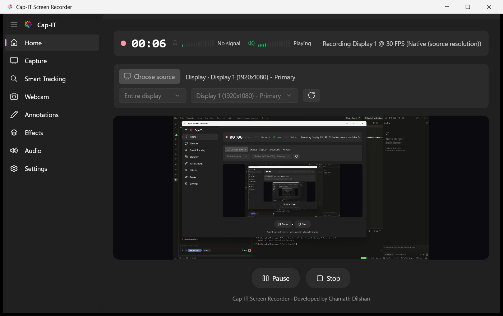

</div>

<br/>

<div align="center">
<table>
<tr>
<td align="center" width="50%">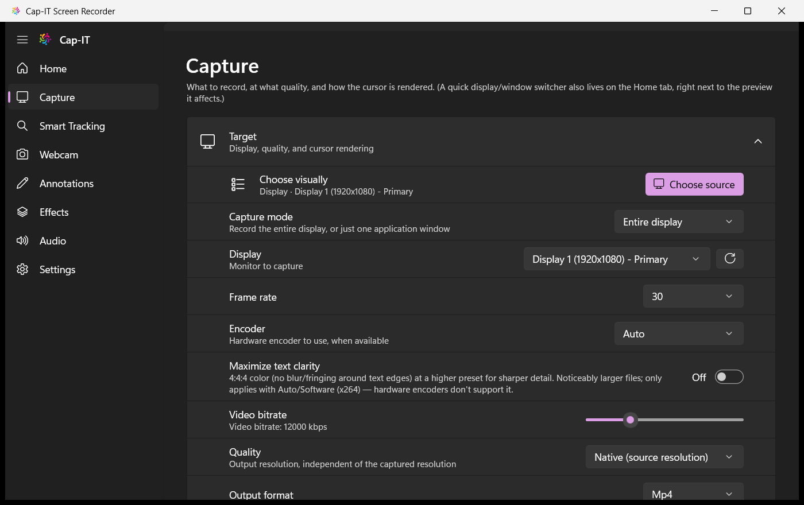<br/><sub><b>Capture</b> — source, frame rate, encoder, quality, cursor</sub></td>
<td align="center" width="50%">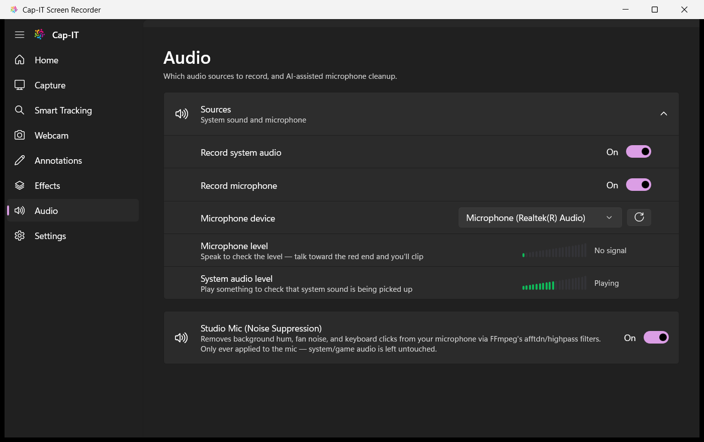<br/><sub><b>Audio</b> — sources, device, live meters, Studio Mic</sub></td>
</tr>
<tr>
<td align="center" width="50%">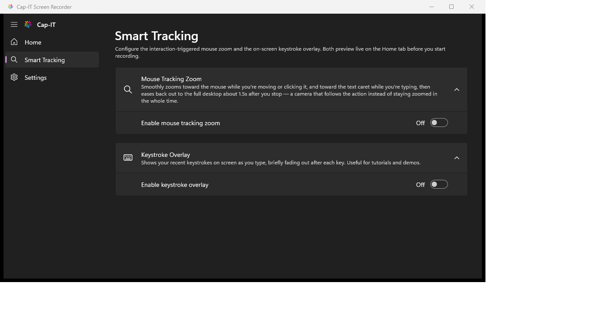<br/><sub><b>Smart Tracking</b> — interaction-triggered zoom & keystroke overlay</sub></td>
<td align="center" width="50%">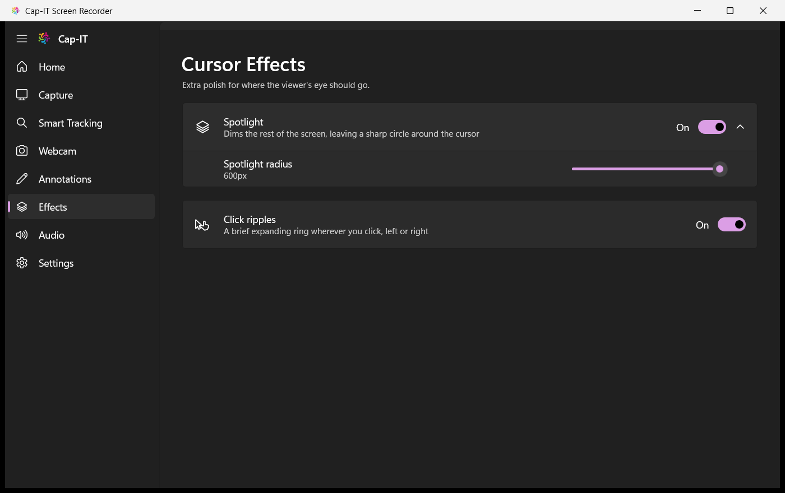<br/><sub><b>Effects</b> — cursor spotlight (live radius) & click ripples</sub></td>
</tr>
<tr>
<td align="center" width="50%">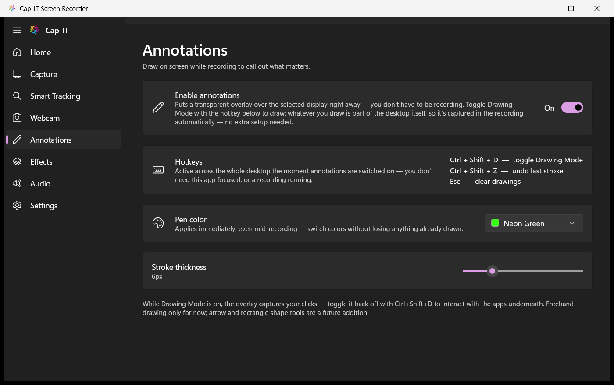<br/><sub><b>Annotations</b> — hotkeys, pen color, stroke thickness</sub></td>
<td align="center" width="50%">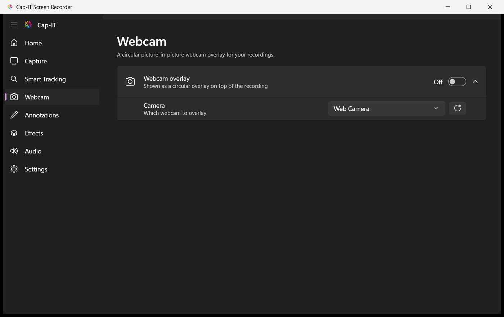<br/><sub><b>Webcam</b> — circular picture-in-picture overlay</sub></td>
</tr>
<tr>
<td align="center" width="50%">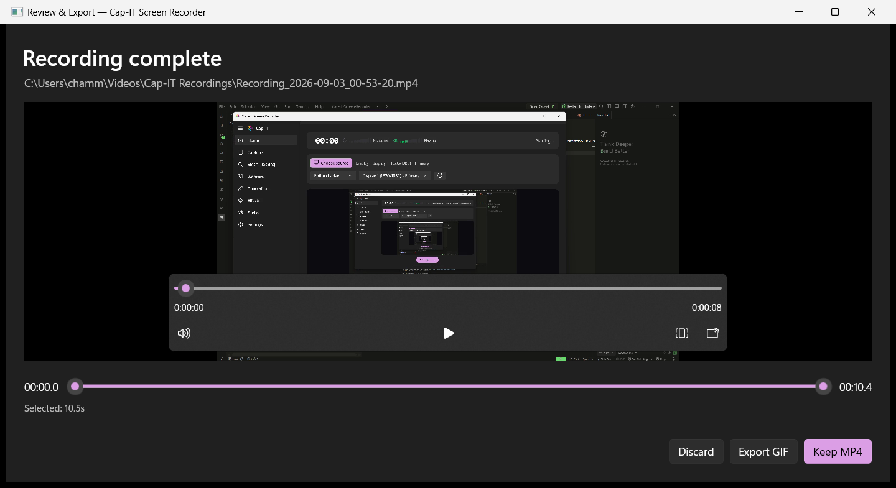<br/><sub><b>Review & Export</b> — trim range, keep MP4, or export GIF</sub></td>
<td align="center" width="50%">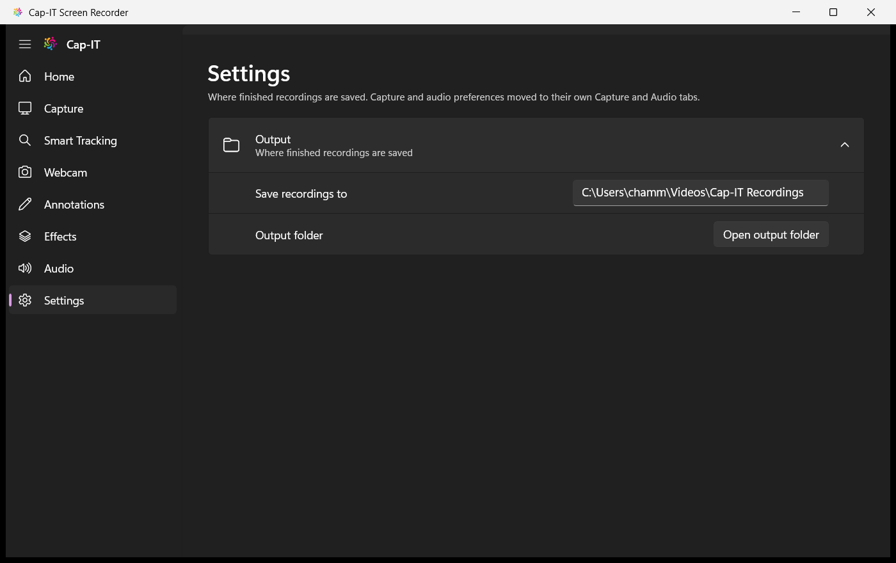<br/><sub><b>Settings</b> — output folder and general preferences</sub></td>
</tr>
</table>
</div>

---

## 📦 Installation

Grab **`CapIT-Screen-Recorder-Setup-2.4.0.exe`** from
**[Releases](../../releases/latest)** and run it. It's a normal Windows installer (built with Inno
Setup) and it's fully self-contained — no separate .NET runtime, no Windows App SDK runtime, and no
manual FFmpeg download.

<div align="center">
<table>
<tr>
<td align="center" width="33%"><br/><sub>1. Choose install mode</sub></td>
<td align="center" width="33%"><br/><sub>2. Choose destination folder</sub></td>
<td align="center" width="33%"><br/><sub>3. Optional desktop shortcut</sub></td>
</tr>
<tr>
<td align="center" width="33%"><br/><sub>4. Confirm and install</sub></td>
<td align="center" width="33%"><br/><sub>5. Installing</sub></td>
<td align="center" width="33%"><br/><sub>6. Done — launch it</sub></td>
</tr>
</table>
</div>

Cap-IT is added to the Start Menu (and Add/Remove Programs for a clean uninstall), with an optional
desktop shortcut. Uninstalling asks whether to also remove your saved settings; **your recordings are
never touched**.

> **Requirements:** Windows 10 version 2004 (build 19041) or later, 64-bit. Windows 11 recommended.

### Updating

Cap-IT checks GitHub Releases once on startup. When a newer version exists you'll get an
**Update available** banner — *Update now* downloads that release's installer, runs it silently over
your existing install, and relaunches the app. Nothing else to do.

---

## 🚀 Quick start

1. **Pick a source.** Hit **Choose source** on the Home tab and click a display or window tile — every
   tile is live, so you can see exactly what you're about to capture.
2. **Check your audio.** The meters next to the timer should move when you speak or play something. If
   one says *unavailable*, pick a different device on the **Audio** tab.
3. **Turn on what you need.** Smart zoom (**Smart Tracking**), webcam PiP (**Webcam**), spotlight and
   click ripples (**Effects**), on-screen drawing (**Annotations**).
4. **Record.** Press **Start Recording** — or use **Select and record** straight from the picker.
5. **Review.** Stopping opens the review window: trim the range, then **Keep MP4**, **Export GIF**, or
   **Discard**.

---

## ⌨️ Keyboard shortcuts

These are global — they work anywhere on the desktop, with no need to focus Cap-IT. They're live
whenever **Annotations** is switched on.

| Shortcut | Action |
|---|---|
| <kbd>Ctrl</kbd> + <kbd>Shift</kbd> + <kbd>D</kbd> | Toggle drawing mode on/off |
| <kbd>Ctrl</kbd> + <kbd>Shift</kbd> + <kbd>Z</kbd> | Undo the last stroke |
| <kbd>Esc</kbd> | Clear all drawings |

While drawing mode is **on**, the overlay captures your clicks. Toggle it back off to interact with
the apps underneath — anything you've drawn stays on screen.

---

## 🛠️ Tech Stack

- **C# / .NET 8**, **WinUI 3** (Windows App SDK), MVVM (`CommunityToolkit.Mvvm`)
- **DXGI Desktop Duplication** (`Vortice.Direct3D11` / `Vortice.DXGI`) for GPU-accelerated full-monitor capture, and **Windows Graphics Capture (WGC)** for single-window capture
- **NAudio** — WASAPI loopback + microphone capture, kept on independent pipes when Studio Mic noise suppression is active so FFmpeg's filters only ever touch the mic signal
- **FFmpeg** (bundled, auto-downloadable on first run) — H.264/AAC encoding and MP4/MKV muxing fed over named pipes for live recording, a two-pass `palettegen`/`paletteuse` pipeline for GIF export, and duration probing for the trim range
- **GDI / GDI+** — `PrintWindow` + `StretchBlt` for the source picker's live thumbnails, and `UpdateLayeredWindow` for the per-pixel-alpha annotation overlay
- **`CommunityToolkit.WinUI.Controls`** — `SettingsCard`/`SettingsExpander` throughout, `RangeSelector` for the trim range
- `MediaPlayerElement` for the post-recording review window
- Raw Win32 interop (`SetWindowsHookEx`, `WS_EX_TRANSPARENT`, layered windows) for the global hotkeys and the click-through overlay
- Unpackaged, self-contained deployment; an [Inno Setup](https://jrsoftware.org/isinfo.php) script builds the Windows installer on top of it

---

## 🗂️ Project layout

```
Views/                  MainWindow, ShellPage (8-tab NavigationView shell), HomePage, CapturePage,
                        TrackingPage, WebcamPage, AnnotationsPage, EffectsPage, AudioPage,
                        SettingsPage, SourcePickerDialog (live-thumbnail source gallery),
                        TrimExportWindow (post-recording review / trim / GIF export)
└── Controls/           LevelMeter (segmented audio level meter)
ViewModels/             BaseViewModel, MainViewModel, CaptureSourceItem (one picker tile)
Models/                 AppSettings, RecordingSettings (+ option-pair records: ResolutionOption,
                        CursorStyleOption, ZoomLevelOption, AnnotationColorOption), MonitorInfo,
                        WindowInfo, CaptureTargetKind, RecordingState
Services/
├── Capture/            VideoCaptureService (DXGI Desktop Duplication + WGC window capture, cursor
│                       rendering, smart zoom, spotlight/click-ripple/keystroke compositing, webcam
│                       PiP), AudioCaptureService, SourceThumbnailService (picker thumbnails),
│                       Mic/SpeakerLevelMonitorService (live meters), device enumerators
│   └── Interop/        Win32 P/Invokes (monitor/window enumeration, window styles, cursor position)
├── Encoding/           FFmpegEncoderService (process + named pipes, dual-leg filter_complex for mic
│                       noise suppression), FFmpegLocator, FFmpegDownloader, MediaDurationProbe
├── Export/             GifExportService (two-pass palettegen/paletteuse, progress parsing)
├── Overlay/            AnnotationOverlayService, AnnotationOverlayWindow (Win32 layered
│                       per-pixel-alpha drawing overlay)
├── Tracking/           GlobalKeyboardHook, GlobalMouseHook, GlobalHotkeyHook
├── RecordingManager.cs Orchestrates capture + encoder + audio into record/pause/stop
├── SettingsService.cs  JSON preferences under %LocalAppData%
└── UpdateService.cs    GitHub Releases update check + in-place installer handoff
ffmpeg/                 Bundled encoder binary goes here (see ffmpeg/README.md)
Installer/              Inno Setup script that packages the published output
app.manifest            DPI awareness, OS compatibility
```

---

## 🔨 Building from source

Requires the **Windows 10/11 SDK** and **MSBuild** (Visual Studio, or the standalone Build Tools) in
addition to the .NET 8 SDK — WinUI 3 projects need the platform toolset, not just `dotnet`. You'll
also need `ffmpeg.exe` in `ffmpeg\` — see [ffmpeg/README.md](ffmpeg/README.md).

```powershell
dotnet restore
dotnet build -c Debug
.\bin\Debug\net8.0-windows10.0.19041.0\win-x64\ScreenRecorderApp.exe
```

### Publishing a standalone build

```powershell
dotnet publish ScreenRecorderApp.csproj -c Release -r win-x64 --self-contained true -o publish
```

`publish\` is fully self-contained (the .NET runtime, the Windows App SDK runtime, and
`ffmpeg\ffmpeg.exe` are all included, as long as `ffmpeg\ffmpeg.exe` existed locally *before* you ran
this). Copy it to any Windows 10/11 x64 machine and run `ScreenRecorderApp.exe` directly. This is also
the folder the installer packages.

### Building the installer

```powershell
& "$env:LOCALAPPDATA\Programs\Inno Setup 6\ISCC.exe" Installer\CapITScreenRecorder.iss
```

Install [Inno Setup 6](https://jrsoftware.org/isdl.php) first (`winget install -e --id JRSoftware.InnoSetup`),
and publish before compiling so `publish\` is current. The installer lands in
`Installer\Output\CapIT-Screen-Recorder-Setup-<version>.exe`.

### Cutting a release

The in-app updater reads GitHub Releases, so each release needs:

1. The version bumped in **two** places, kept in lockstep — `<Version>` in `ScreenRecorderApp.csproj`
   (the app reads this back at runtime to compare) and `MyAppVersion` in
   `Installer\CapITScreenRecorder.iss`.
2. A publish, then an installer build.
3. A GitHub Release tagged `vX.Y.Z` with `CapIT-Screen-Recorder-Setup-X.Y.Z.exe` attached.

Draft and pre-release releases are ignored by the updater.

---

## ⚙️ How recording works

1. `VideoCaptureService.Prepare()` sets up either a DXGI Desktop Duplication session (display capture)
   or a Windows Graphics Capture session (window capture) on the chosen target, resolving the real
   capture resolution without starting frame delivery yet. Which one it builds is decided solely by the
   capture-target kind the user selected.
2. `FFmpegEncoderService.StartAsync()` spawns `ffmpeg.exe` and waits for it to connect to the **video**
   named pipe only.
3. `VideoCaptureService.BeginCapture()` starts a dedicated capture thread that copies each frame into a
   shared buffer and composites in the cursor overlay, smart zoom, spotlight, click ripples, keystroke
   overlay, and webcam PiP. A pacing loop writes the most recent frame to the pipe on every tick at the
   target FPS, decoupling event-driven capture from FFmpeg's fixed-rate `rawvideo` input and
   duplicating the last frame when nothing changed (or while paused) so output stays in sync with real
   elapsed time.
4. Once real frame bytes are flowing, the **audio** pipe is connected (FFmpeg won't probe a second
   input until the first has data). With Studio Mic active and both sources enabled, a *third* pipe is
   connected the same way and FFmpeg's `-filter_complex` applies `highpass`/`adeclick`/`afftdn` to the
   mic leg alone before `amix` merges it with untouched system audio.
5. `AudioCaptureService` mixes (or, in the dual-pipe case, keeps separate) WASAPI loopback +
   microphone into 48 kHz stereo PCM16.
6. If annotations are enabled, a transparent, click-through, always-on-top layered overlay sits over
   the display. Because it's a real desktop window with genuine per-pixel alpha, Desktop Duplication
   captures your strokes as part of the normal desktop composition — and captures the desktop *through*
   the parts you haven't drawn on.
7. On stop, the pipes close and `q` goes to FFmpeg's stdin so it finalizes cleanly. Output uses
   fragmented MP4 rather than `+faststart`, so there's no expensive rewrite-the-whole-file step and the
   file stays valid even under a forced shutdown. The review window then opens to trim, export, or
   discard.

## 🔍 How the smart zoom & text clarity work

Zoom and the "sharp text" work both happen frame-by-frame in `VideoCaptureService`, on the same raw
BGRA buffer the cursor overlay is composited into — not with FFmpeg filters, since a live `zoompan`
can't practically be steered by an external, constantly-changing cursor/caret signal.

- **Activity tracking** — mouse movement comes from the capture API's own per-frame pointer position;
  clicks from a `WH_MOUSE_LL` hook; typing from a `WH_KEYBOARD_LL` hook. Whichever fired most recently
  decides the pan target, and typing looks up the real text caret via `GetGUIThreadInfo` rather than
  the last mouse position.
- **Easing** — both zoom factor and pan position ease toward their targets with `1 - e^(-dt/τ)`, a
  proper time-constant ease driven by real elapsed time, so motion stays smooth regardless of the
  capture thread's variable frame timing.
- **Resampling** — the zoomed crop is resampled with a 16-tap separable **Catmull-Rom** kernel
  (Mitchell–Netravali B=0, C=0.5). Bilinear's positive-only weights are exactly what softens edges;
  Catmull-Rom's small negative lobes recover that lost contrast, which is what keeps zoomed text
  legible, at roughly 4× bilinear's per-pixel cost.
- **Encoding** — every encoder uses content-adaptive rate control capped by your bitrate as
  `-maxrate`/`-bufsize`, so detailed regions get more bits automatically. "Maximize text clarity"
  additionally switches libx264 to `yuv444p`/`high444`, removing chroma-subsampling fringing around
  colored text — opt-in, since it costs meaningfully more bitrate and isn't reliably supported by
  consumer NVENC/AMF/QSV.

---

## 🧪 Notable fixes along the way

**Intermittent crash after a few seconds of recording.** Early builds used `Windows.Graphics.Capture`
through hand-written WinRT interop and would reliably crash with `AccessViolationException` inside
`WinRT.IObjectReference.Finalize()` — a native/managed-boundary crash on the GC finalizer thread that
no managed handler can catch. Fixed by rewriting monitor capture on DXGI Desktop Duplication, which is
plain COM with no WinRT projection, eliminating the entire class of crash. WGC was later reintroduced
scoped strictly to window capture, where Desktop Duplication has no equivalent.

**"Item is unplayable" in VLC on large recordings.** MP4s used `-movflags +faststart`, which rewrites
the entire file on stop; for a long, high-bitrate recording that rewrite could outlast the shutdown
grace period, and a forced kill mid-rewrite left a file with no moov atom at all. Fixed with fragmented
MP4, written incrementally as recording progresses.

**Cursor overlay not appearing.** DXGI's `PointerPosition` is only valid on the frame where the cursor
actually changed; on every other frame it's zeroed rather than repeated. The fix retains the last known
position instead of overwriting it with stale zeros.

**Webcam PiP lag and dropout on monitor switch.** An early compositing pass re-decoded and re-scaled the
circular overlay every frame, and tore the camera down whenever the video capture target changed. Fixed
by decoupling webcam lifecycle from video-capture lifecycle entirely.

**GIFs looking dithered and banded.** A single-pass MP4→GIF conversion falls back to a generic fixed
256-color palette. Fixed with the standard two-pass approach — `palettegen` builds an optimal palette
for the exact trimmed clip, then `paletteuse` dithers onto it.

**And the two fixed in v2.3.0 / v2.4.0** — "Video could not be decoded" in the review window (Media
Foundation can't decode the fragmented MP4 the app records for crash-safety; recordings are now
remuxed to a standard MP4 on stop), and a Pause that never actually shortened the file.
[Full write-up above.](#-whats-new-in-v240)

---

## 📄 License & credits

Cap-IT Screen Recorder — designed and developed by **[Chamath Dilshan](https://github.com/ChamathDilshanC)**.

Bundles [FFmpeg](https://ffmpeg.org/) (LGPL/GPL, depending on build) for encoding and export. Built on
the [Windows App SDK](https://github.com/microsoft/WindowsAppSDK),
[NAudio](https://github.com/naudio/NAudio), [Vortice.Windows](https://github.com/amerkoleci/Vortice.Windows),
and the [.NET Community Toolkit](https://github.com/CommunityToolkit).

<div align="center">
<br/>

**[⬇ Download the latest release](../../releases/latest)** &nbsp;·&nbsp; [Report an issue](../../issues)

<sub>If Cap-IT is useful to you, a ⭐ on the repo is genuinely appreciated.</sub>

</div>
