<div align="left">


# Cap-IT Screen Recorder

### A focused, GPU-assisted Windows screen recorder for polished tutorials, demos, bug reports, and social clips.

Capture the right source, follow the action with smart zoom, draw over the desktop, clean up audio, compose
the result, and export without leaving the app.

<a href="https://github.com/ChamathDilshanC/Cap-IT-Screen-Recorder/releases/latest"></a>
<a href="docs/screenshots/README.md"></a>
<a href="https://github.com/ChamathDilshanC/Cap-IT-Screen-Recorder/issues"></a>


<br />
<br />

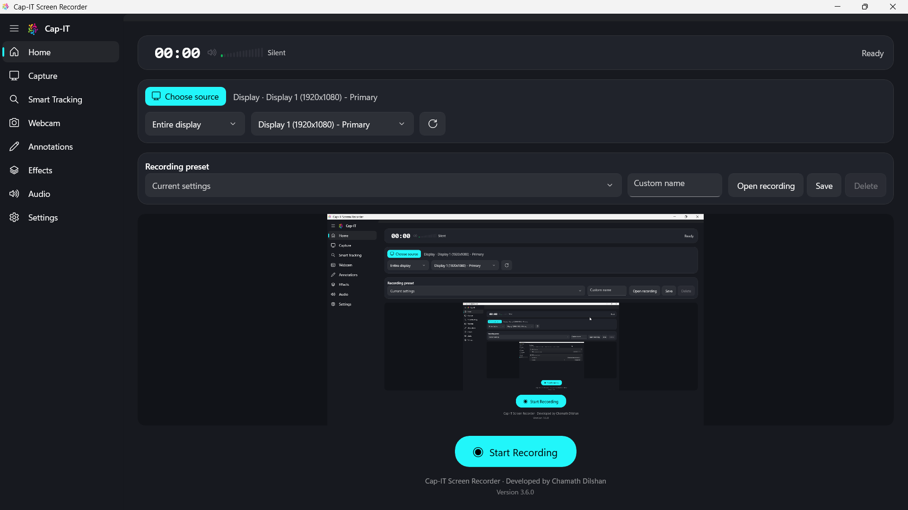

</div>

---

## Why Cap-IT

Cap-IT is built around one idea: **the recording should be easy, while the result should look intentional**.
The native Windows workflow keeps source selection, live preview, recording, audio monitoring, effects,
annotations, editing, and export in one place.

| Capture | Enhance | Finish |
|:---:|:---:|:---:|
| Displays, windows, live thumbnails | Smart zoom, cursor effects, webcam, keystrokes | Trim, compose, text, frames, MP4, GIF |
| DXGI Desktop Duplication + WGC | GPU-assisted effects and live preview | Review & Export workspace |

## Product workflow

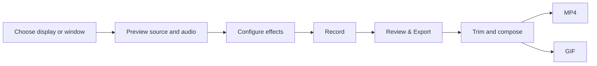

---

## Feature highlights

<table>
<tr>
<td width="50%" valign="top">

### 🎥 Capture what matters

- Full-monitor capture through DXGI Desktop Duplication
- Single-window capture through Windows Graphics Capture
- Live source-picker thumbnails for displays and windows
- 15/24/30/60 FPS capture with 360p to 4K output
- NVIDIA NVENC, AMD AMF, Intel QSV, and software H.264 fallback

</td>
<td width="50%" valign="top">

### 🎯 Smart Tracking

- Interaction-triggered zoom that follows the cursor and text caret
- Critically damped, no-overshoot camera motion
- Click-only zoom mode
- Instant zoom-out toggle
- 0–50% animation speed control
- Live preview and mid-recording updates

</td>
</tr>
<tr>
<td width="50%" valign="top">

### ✨ Visual polish

- Cursor spotlight with adjustable radius
- Left and right click ripples
- Selectable cursor styles
- Webcam picture-in-picture templates
- Keystroke overlay
- Live desktop annotation overlay

</td>
<td width="50%" valign="top">

### 🧩 Review & Export

- Media preview with trim timeline
- Zoom regions and composition presets
- Canvas ratios: original, 16:9, 9:16, 1:1, 4:5, 3:2, 4:3, custom
- Backgrounds, rounded corners, shadows, borders, and device frames
- Multiple text layers with system fonts, color, opacity, alignment, and bounce-letter animation
- MP4 preservation and two-pass GIF export

</td>
</tr>
</table>

## Visual tour

The complete native **1920 × 1080** gallery is available in
[`docs/screenshots/README.md`](docs/screenshots/README.md).

<div align="center">
<table>
<tr>
<td>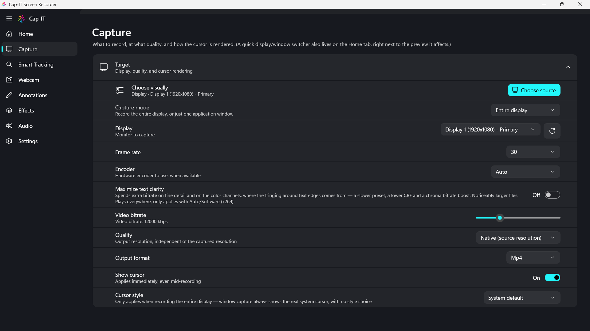</td>
<td>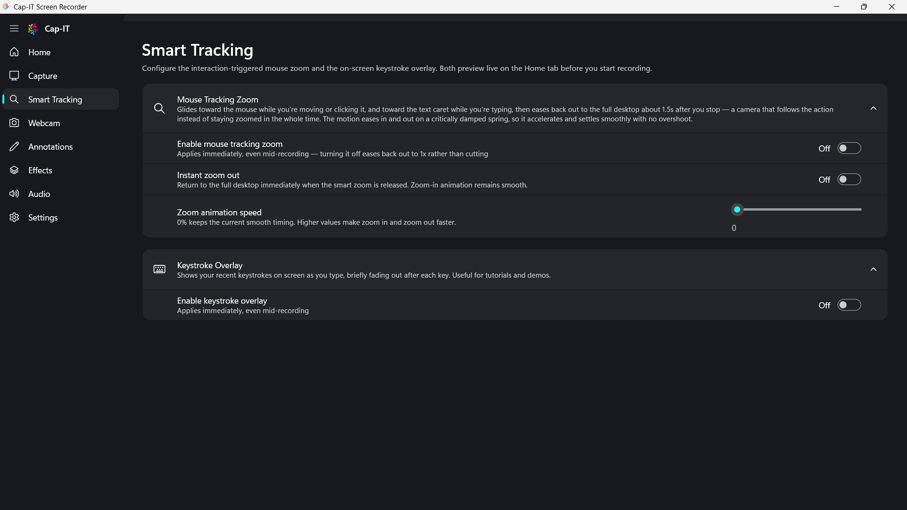</td>
</tr>
<tr>
<td align="center"><sub><b>Capture</b> · source, encoder, quality, cursor</sub></td>
<td align="center"><sub><b>Smart Tracking</b> · zoom, speed, keystrokes</sub></td>
</tr>
<tr>
<td>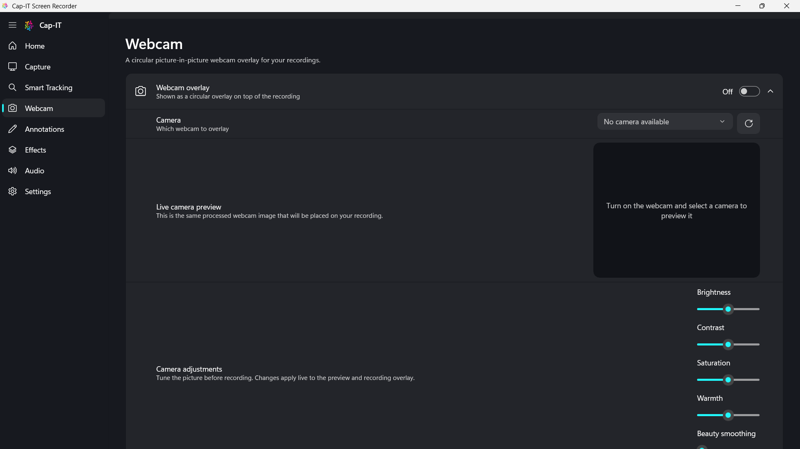</td>
<td>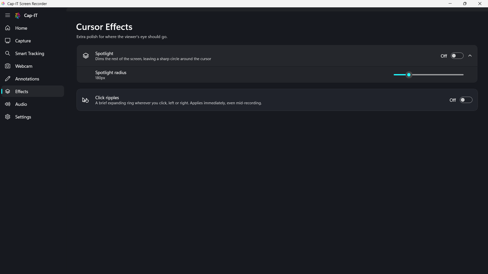</td>
</tr>
<tr>
<td align="center"><sub><b>Webcam</b> · picture-in-picture templates</sub></td>
<td align="center"><sub><b>Effects</b> · spotlight and click ripples</sub></td>
</tr>
<tr>
<td>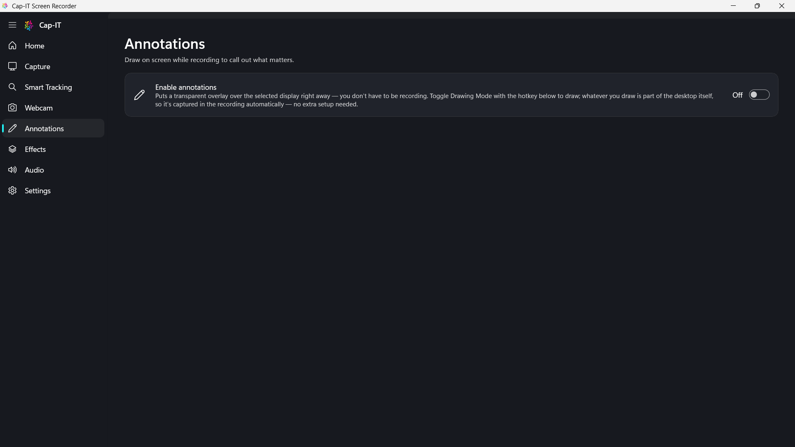</td>
<td>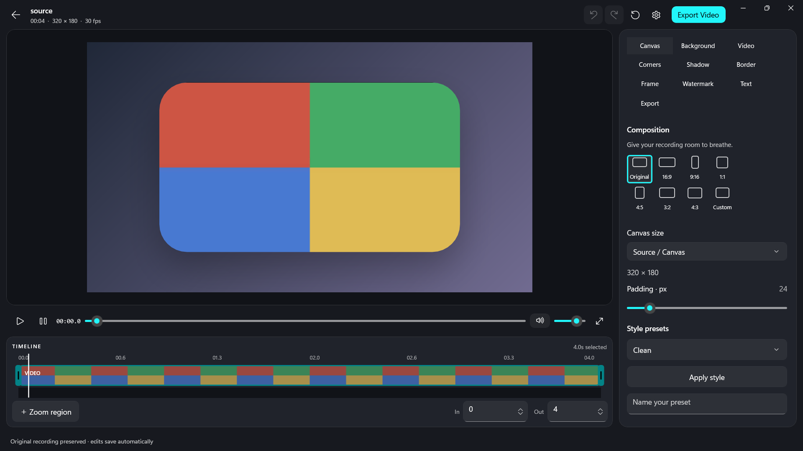</td>
</tr>
<tr>
<td align="center"><sub><b>Annotations</b> · draw while recording</sub></td>
<td align="center"><sub><b>Review & Export</b> · compose and deliver</sub></td>
</tr>
</table>
</div>

### Special feature states

<div align="center">
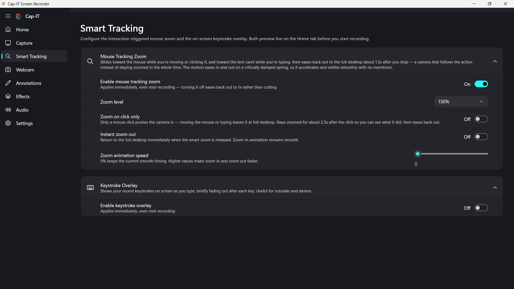
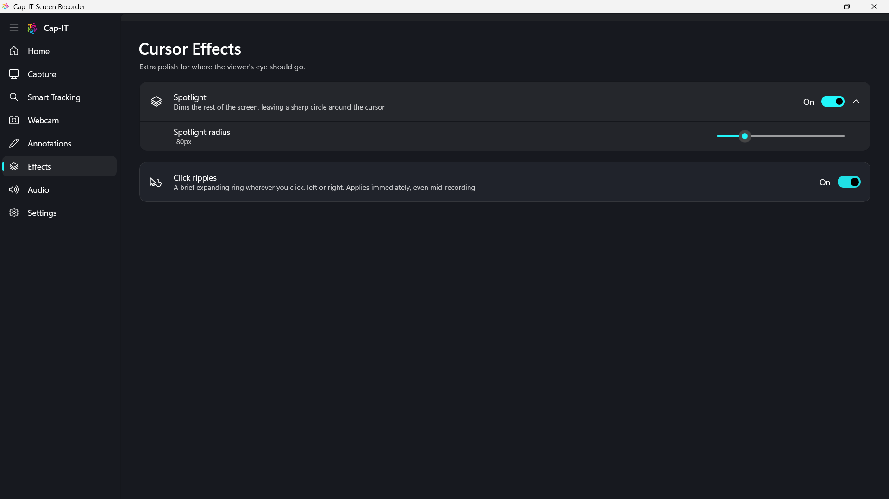
<br />
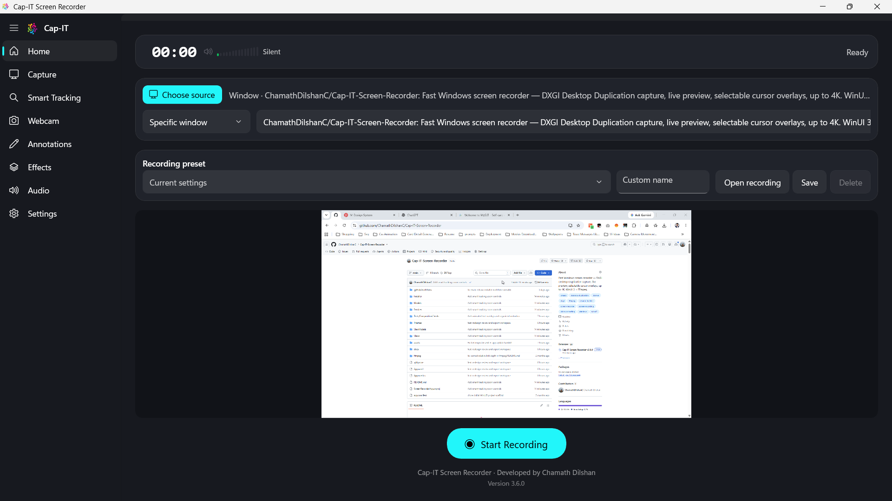
</div>

---

## Review & Export at a glance

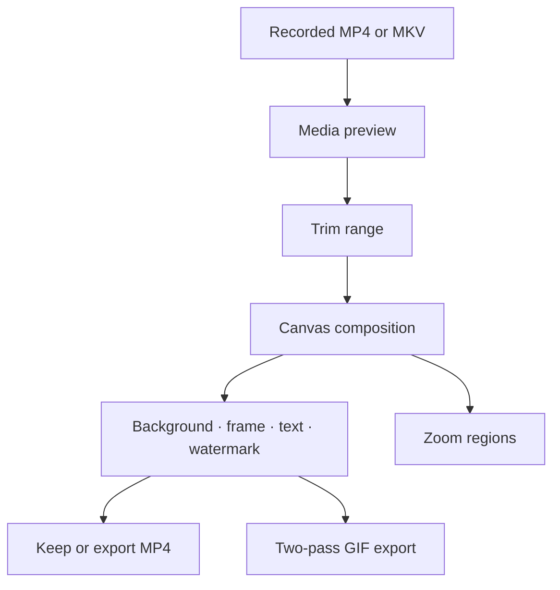

The editor keeps the original recording safe while presentation metadata lives beside the video in a
dedicated `Cap-IT Metadata` folder. Older sidecar files remain readable for compatibility.

---

## Installation

Download **`CapIT-Screen-Recorder-Setup-3.6.0.exe`** from
the [latest GitHub Release](https://github.com/ChamathDilshanC/Cap-IT-Screen-Recorder/releases/latest)
and run it. The installer is self-contained: no separate .NET runtime, Windows App SDK runtime, or
manual FFmpeg setup is required.

> **Requirements:** Windows 10 version 2004 (build 19041) or later, 64-bit. Windows 11 recommended.

The installer adds Cap-IT to the Start Menu and supports an optional desktop shortcut. Uninstalling
does not remove your recordings.

### Updating

Cap-IT checks GitHub Releases on startup and while the app is open. When a new release is available,
**Update now** downloads the installer, waits for the running app to close, installs the update, and
relaunches Cap-IT.

---

## Quick start

1. Open **Choose source** and select a display or window.
2. Check system audio and microphone levels on **Audio**.
3. Enable **Smart Tracking**, **Webcam**, **Effects**, or **Annotations** as needed.
4. Press **Start Recording**.
5. Stop recording to open **Review & Export**.
6. Trim, compose, add text or frames, then keep the MP4 or export a GIF.

---

## Keyboard shortcuts

These global shortcuts are available while Annotations is enabled:

| Shortcut | Action |
|---|---|
| <kbd>Ctrl</kbd> + <kbd>Shift</kbd> + <kbd>D</kbd> | Toggle drawing mode |
| <kbd>Ctrl</kbd> + <kbd>Shift</kbd> + <kbd>Z</kbd> | Undo the last stroke |
| Hold <kbd>Shift</kbd> | Constrain rectangles and circles |
| Hold <kbd>Alt</kbd> | Resize a shape from its center |
| <kbd>Ctrl</kbd> + <kbd>D</kbd> | Duplicate the selected annotation |
| <kbd>Esc</kbd> | Clear all drawings |

---

## Architecture

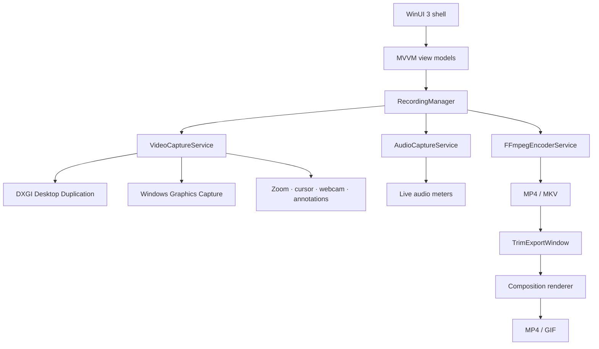

### Project map

| Area | Location |
|---|---|
| WinUI shell and pages | [`Views/`](Views/) |
| MVVM state and commands | [`ViewModels/`](ViewModels/) |
| Capture and recording pipeline | [`Services/Capture/`](Services/Capture/) |
| Audio and encoding | [`Services/`](Services/) |
| Composition and exports | [`Services/Export/`](Services/Export/) |
| Domain settings and metadata | [`Models/`](Models/) |
| Regression checks | [`Tests/CompositionChecks/`](Tests/CompositionChecks/) |
| Release automation | [`.github/workflows/`](.github/workflows/) |

---

## Build from source

```powershell
dotnet restore
dotnet build ScreenRecorderApp.csproj --no-restore
dotnet run --project Tests\CompositionChecks\CompositionChecks.csproj --no-restore
```

The composition checks validate geometry, metadata compatibility, MP4 output, GIF output, and the
shared preview/export rendering path.

---

## Technical foundation

- **C# / .NET 8** and **WinUI 3**
- **CommunityToolkit.Mvvm** and **CommunityToolkit.WinUI.Controls**
- **DXGI Desktop Duplication** and **Windows Graphics Capture**
- **Vortice.Direct3D11 / Vortice.DXGI**
- **NAudio** WASAPI loopback and microphone capture
- **FFmpeg** named-pipe recording and two-pass GIF export
- **GDI / GDI+** source thumbnails and annotation overlay
- Raw Win32 hooks for global input and capture coordination

---

## Release history

| Version | Highlights |
|---|---|
| [v3.6.0](https://github.com/ChamathDilshanC/Cap-IT-Screen-Recorder/releases/tag/v3.6.0) | Smart Tracking instant zoom-out, adjustable animation speed, live propagation, and preset persistence |
| [v3.5.0](https://github.com/ChamathDilshanC/Cap-IT-Screen-Recorder/releases/tag/v3.5.0) | Multiple text layers, alignment, colors, opacity, bounce-letter animation, and Safari-style browser frame |
| [v3.4.3](https://github.com/ChamathDilshanC/Cap-IT-Screen-Recorder/releases/tag/v3.4.3) | Responsive text dragging and review-canvas interaction |

---

## Author

Designed and developed by **[Chamath Dilshan](https://github.com/ChamathDilshanC)**.

## Feedback and contributing

Found a bug or have an idea? Open a
[GitHub issue](https://github.com/ChamathDilshanC/Cap-IT-Screen-Recorder/issues) with your Windows
version, capture target, and a short reproduction. Pull requests are welcome for focused improvements
that preserve the native Windows workflow.

## License

See [`LICENSE`](LICENSE) for the project license.
