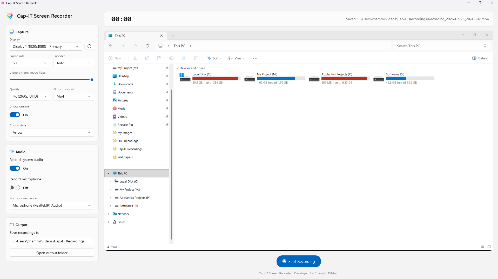

<div align="center">


# Cap-IT Screen Recorder

A fast, modern Windows screen recorder — GPU-accelerated capture, live preview, selectable cursor
overlays, and quality up to 4K, wrapped in a clean WinUI 3 interface.

[](#)
[](#)
[](#)
[](#)

[**⬇ Download the installer**](../../releases/latest) &nbsp;·&nbsp; [Features](#features) &nbsp;·&nbsp; [Installation](#installation) &nbsp;·&nbsp; [Building from source](#building-from-source)

<br/>



</div>

## Features

- **GPU-accelerated capture** of any connected monitor via the DXGI Desktop Duplication API (no screen-scraping, no WinRT interop)
- **Live preview** of exactly what's being captured, shown in the main panel as soon as a display is selected — not just while recording
- **Selectable output quality**, 360p up to 4K, scaled independently of the native capture resolution
- **Selectable cursor overlay** — the real system cursor shape (decoded live from DXGI, whatever cursor theme is active), or a stylized Arrow / Circle highlight / Dot / Crosshair
- **Frame rate** (15/24/30/60) and **H.264 encoder** choice (Auto / NVIDIA NVENC / AMD AMF / Intel QSV / software x264, with automatic fallback)
- **System audio** (WASAPI loopback) and/or **microphone**, mixed to one AAC track
- **Pause / Resume** — freezes the frame and mutes audio without ending the file
- **MP4 or MKV** output, to a configurable folder
- Clean, card-based, modern settings layout

## Installation

Download the latest installer from **[Releases](../../releases/latest)** and run it — no admin rights
required (you can install just for yourself, or for all users if you choose to elevate).

<div align="center">
<table>
<tr>
<td align="center" width="33%"><br/><sub>1. Choose install mode</sub></td>
<td align="center" width="33%"><br/><sub>2. Choose destination folder</sub></td>
<td align="center" width="33%"><br/><sub>3. Optional desktop shortcut</sub></td>
</tr>
<tr>
<td align="center" width="33%"><br/><sub>4. Confirm and install</sub></td>
<td align="center" width="33%"><br/><sub>5. Installing</sub></td>
<td align="center" width="33%"><br/><sub>6. Done — launch it</sub></td>
</tr>
</table>
</div>

That's it — Cap-IT Screen Recorder is added to the Start Menu (and Add/Remove Programs for a clean
uninstall later), with an optional desktop shortcut.

## Tech stack

- **C# / .NET 8**, **WinUI 3** (Windows App SDK), MVVM (CommunityToolkit.Mvvm)
- **DXGI Desktop Duplication API** (`Vortice.Direct3D11` / `Vortice.DXGI`) for GPU-accelerated monitor capture (BGRA frames) and live cursor shape/position tracking
- **NAudio** (WASAPI loopback + microphone capture, mixed to one PCM stream)
- **FFmpeg** (bundled `ffmpeg.exe`) for H.264/AAC encoding and MP4/MKV muxing, fed over named pipes
- Unpackaged, self-contained deployment (no separate Windows App SDK runtime install needed); an [Inno Setup](https://jrsoftware.org/isinfo.php) script builds a normal Windows installer on top of that

## Project layout

```
Views/                  MainWindow, MainPage (XAML UI)
ViewModels/             BaseViewModel, MainViewModel (CommunityToolkit.Mvvm)
Models/                 RecordingSettings, MonitorInfo, RecordingState, enums
Services/
├── Capture/            VideoCaptureService (DXGI Desktop Duplication + cursor rendering),
│                       AudioCaptureService, Monitor/AudioDevice enumerators, CursorIcons
│   └── Interop/        Win32 monitor-enumeration P/Invokes
├── Encoding/            FFmpegEncoderService (process + named pipes), FFmpegLocator
└── RecordingManager.cs  Orchestrates capture + encoder into record/pause/stop
ffmpeg/                 Bundled encoder binary goes here (see ffmpeg/README.md)
Installer/CapIT.iss     Inno Setup script that packages the published output into a Windows installer
app.manifest            DPI awareness, OS compatibility
```

## Building from source

Requires the **Windows 10/11 SDK** and **MSBuild** (Visual Studio, or the standalone Build Tools) in
addition to the .NET 8 SDK — WinUI 3 projects need the platform toolset, not just `dotnet`. You'll
also need `ffmpeg.exe` in `ffmpeg\` — see [ffmpeg/README.md](ffmpeg/README.md).

```powershell
dotnet restore
dotnet build -p:Platform=x64 -c Debug
.\bin\x64\Debug\net8.0-windows10.0.19041.0\win-x64\ScreenRecorderApp.exe
```

The build automatically restores `Microsoft.WindowsAppSDK`, `CommunityToolkit.Mvvm`, `NAudio`,
`Vortice.Direct3D11`/`Vortice.DXGI` from NuGet.

### Publishing a standalone exe

```powershell
dotnet publish -c Release -p:Platform=x64 -r win-x64 --self-contained true
```

Output goes to `bin\x64\Release\net8.0-windows10.0.19041.0\win-x64\publish\`. That folder is fully
self-contained (.NET runtime, Windows App SDK runtime, and `ffmpeg\ffmpeg.exe` are all included) —
zip it up or copy it as-is to another Windows 10/11 x64 PC and run `ScreenRecorderApp.exe` directly.

### Building the installer

```powershell
& "C:\Users\<you>\AppData\Local\Programs\Inno Setup 6\ISCC.exe" Installer\CapIT.iss
```

(Install [Inno Setup 6](https://jrsoftware.org/isdl.php) first, or `winget install -e --id JRSoftware.InnoSetup`.)
Publish first so `bin\x64\Release\...\publish\` is up to date — the script packages that folder.
The resulting installer is written to `Installer\Output\CapIT-Screen-Recorder-Setup.exe`.

## How recording works (high level)

1. `VideoCaptureService.Prepare()` creates a D3D11 device on the adapter that owns the chosen monitor and calls `IDXGIOutput1.DuplicateOutput()` to get an `IDXGIOutputDuplication` — this resolves the real capture resolution without starting frame delivery yet.
2. `FFmpegEncoderService.StartAsync()` spawns `ffmpeg.exe` and waits for it to connect to the **video** named pipe only.
3. `VideoCaptureService.BeginCapture()` starts a dedicated capture thread that calls `AcquireNextFrame`/`ReleaseFrame` in a loop, copying each frame into a shared buffer and blending in the selected cursor overlay. A pacing loop (`RecordingManager.PacerLoopAsync`) writes the most recently captured frame to the pipe on every tick at the target FPS — this decouples Desktop Duplication's event-driven delivery from FFmpeg's fixed-rate `rawvideo` input, and duplicates the last frame when nothing on screen has changed (or while paused) so the output stays in sync with real elapsed time. The same shared frame buffer also feeds the live on-screen preview.
4. Once real frame bytes are flowing, `FFmpegEncoderService.WaitForAudioConnectionAsync()` connects the **audio** pipe (FFmpeg won't probe a second input until the first one has data — connecting both pipes before any writer exists deadlocks).
5. `AudioCaptureService` mixes WASAPI loopback + microphone into 48kHz stereo PCM16 and pumps it into the audio pipe.
6. On Stop, the pipes are closed and `q` is sent to FFmpeg's stdin so it finalizes the MP4/MKV cleanly. Output uses fragmented MP4 rather than `+faststart`, so there's no expensive rewrite-the-whole-file step on stop — large/high-bitrate recordings finalize quickly and stay valid even under a forced shutdown.

## Notable fixes along the way

**Intermittent crash after a few seconds of recording.** Earlier builds used `Windows.Graphics.Capture`
via hand-written WinRT interop, and would reliably crash with `System.AccessViolationException` inside
`WinRT.IObjectReference.Finalize()` — a native/managed-boundary crash on the GC finalizer thread,
uncatchable by any managed exception handler. Fixed by rewriting capture from scratch on the DXGI
Desktop Duplication API, which is plain COM with no WinRT projection involved — eliminating the entire
class of finalizer-thread crashes rather than patching around it.

**"Item is unplayable" in VLC on large/4K recordings.** MP4s used `-movflags +faststart`, which
rewrites the *entire file* on stop to move the moov atom to the front — for a large, high-bitrate
recording that rewrite could outlast the shutdown grace period, and a forced kill mid-rewrite left a
file with no moov atom at all. Fixed by switching to fragmented MP4, which is written incrementally as
recording progresses, so there's no expensive rewrite step and the file stays valid throughout.

**Cursor overlay not appearing.** DXGI's `PointerPosition` is only valid on the specific frame where
the cursor actually changed; on every other frame it's zeroed out rather than repeating the last known
state. The fix retains the last known position/visibility instead of overwriting it with those stale
zeroed values every frame.
