<div align="left">


# Cap-IT Screen Recorder

### A focused, GPU-assisted Windows screen recorder for polished tutorials, demos, bug reports, and social clips.

Capture the right source, follow the action with smart zoom, draw over the desktop, clean up audio, compose
the result, and export without leaving the app.

<a href="https://github.com/ChamathDilshanC/Cap-IT-Screen-Recorder/releases/latest"></a>
<a href="https://github.com/ChamathDilshanC/Cap-IT-Screen-Recorder/releases/download/v3.14.0/CapIT-Screen-Recorder-Setup-3.14.0.exe"></a>
<a href="docs/screenshots/README.md"></a>
<a href="Cap-IT-Brand-Book.pdf"></a>
<a href="https://github.com/ChamathDilshanC/Cap-IT-Screen-Recorder/issues"></a>


<br />
<br />

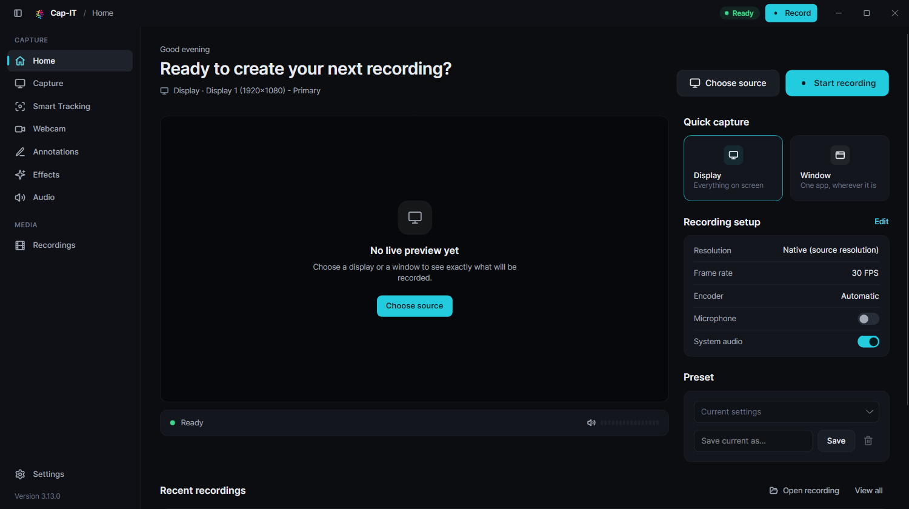

</div>

---

## Why Cap-IT

Cap-IT is built around one idea: **the recording should be easy, while the result should look intentional**.
The native Windows workflow keeps source selection, live preview, recording, audio monitoring, effects,
annotations, editing, and export in one place.

| Capture | Enhance | Finish |
|:---:|:---:|:---:|
| Displays, windows, live thumbnails | Smart zoom, cursor effects, webcam, keystrokes | Trim, compose, text, frames, MP4, GIF |
| DXGI Desktop Duplication + WGC | GPU-assisted effects and live preview | Review & Export workspace, recordings library |

## Product workflow

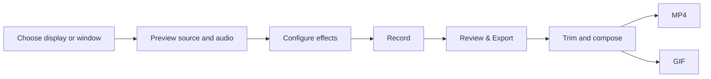
```mermaid
flowchart LR
    A[Choose display or window] --> B[Preview source and audio]
    B --> C[Configure effects]
    C --> D[Record]
    D --> E[Review & Export]
    E --> F[Trim and compose]
    F --> G[MP4]
    F --> H[GIF]
```

---

## Feature highlights

<table>
<tr>
<td width="50%" valign="top">

### 🎥 Capture what matters

- Full-monitor capture through DXGI Desktop Duplication
- Single-window capture through Windows Graphics Capture
- Live source-picker thumbnails for displays and windows
- 15/24/30/60 FPS capture with 360p to 4K output
- NVIDIA NVENC, AMD AMF, Intel QSV, and software H.264 fallback

</td>
<td width="50%" valign="top">

### 🎯 Smart Tracking

- Interaction-triggered zoom that follows the cursor and text caret
- Critically damped, no-overshoot camera motion
- Click-only zoom mode
- Instant zoom-out toggle
- 0–50% animation speed control
- Live preview and mid-recording updates

</td>
</tr>
<tr>
<td width="50%" valign="top">

### ✨ Visual polish

- Cursor spotlight with adjustable radius
- Left and right click ripples
- Configurable click sounds with four selectable effects and volume control
- Selectable cursor styles
- Webcam picture-in-picture templates
- Keystroke overlay
- Live desktop annotation overlay
- Floating recording controller that never appears in the recording

</td>
<td width="50%" valign="top">

### 🧩 Review & Export

- Media preview with trim timeline
- Zoom regions and composition presets
- Canvas ratios: original, 16:9, 9:16, 1:1, 4:5, 3:2, 4:3, custom
- Backgrounds, rounded corners, shadows, borders, and device frames
- Multiple text layers with system fonts, color, opacity, alignment, and bounce-letter animation
- MP4 preservation and two-pass GIF export
- Recordings library with search, thumbnails and grid/list views

</td>
</tr>
</table>

## Visual tour

The v3.13.1 and v3.14.0 releases change Smart Tracking, recording timing and audio without changing the page layouts;
the current Avalonia screenshot gallery remains [`v3.13.0/`](docs/screenshots/v3.13.0/README.md).

<div align="center">
<table>
<tr>
<td>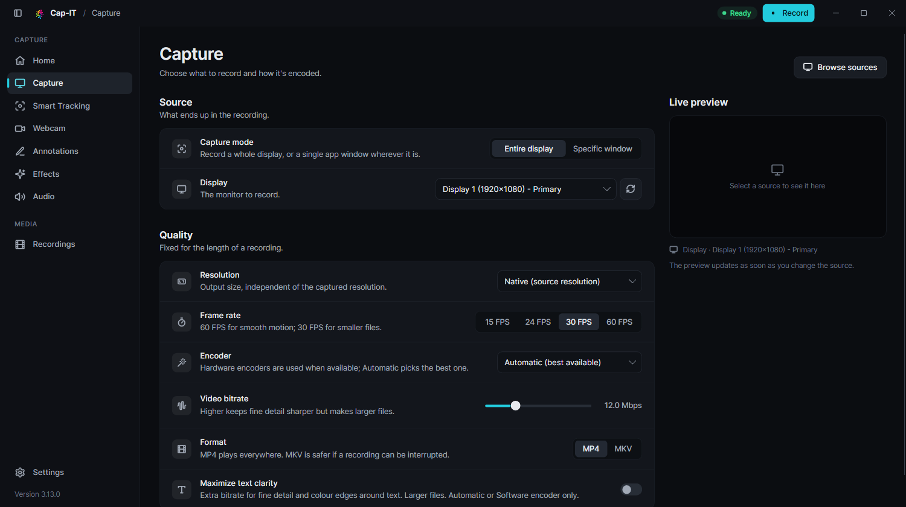</td>
<td>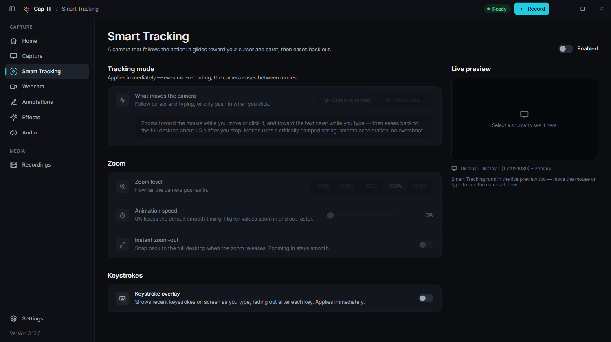</td>
</tr>
<tr>
<td align="center"><sub><b>Capture</b> · source, encoder, quality, cursor</sub></td>
<td align="center"><sub><b>Smart Tracking</b> · zoom, speed, keystrokes</sub></td>
</tr>
<tr>
<td>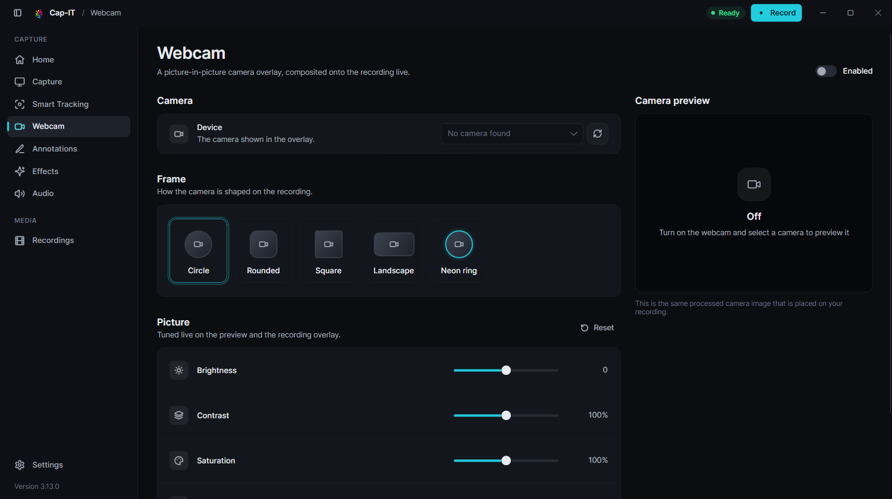</td>
<td>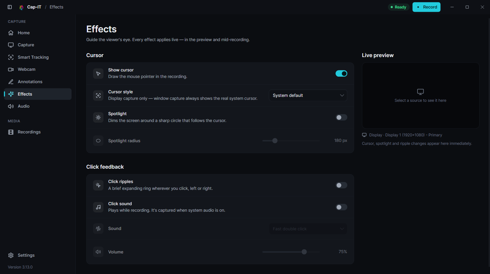</td>
</tr>
<tr>
<td align="center"><sub><b>Webcam</b> · picture-in-picture templates</sub></td>
<td align="center"><sub><b>Effects</b> · spotlight, click ripples, and click sounds</sub></td>
</tr>
<tr>
<td>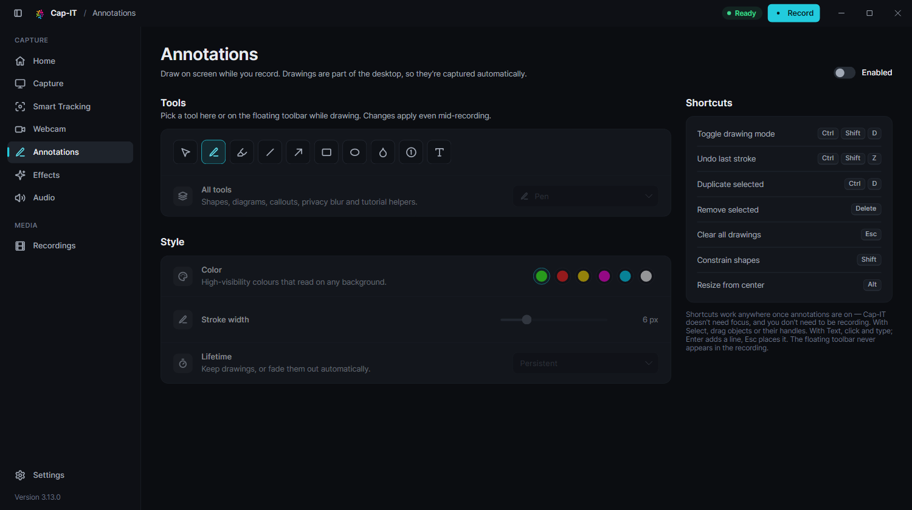</td>
<td></td>
</tr>
<tr>
<td align="center"><sub><b>Annotations</b> · draw while recording</sub></td>
<td align="center"><sub><b>Review & Export</b> · compose and deliver</sub></td>
</tr>
</table>
</div>

### More screens

<div align="center">
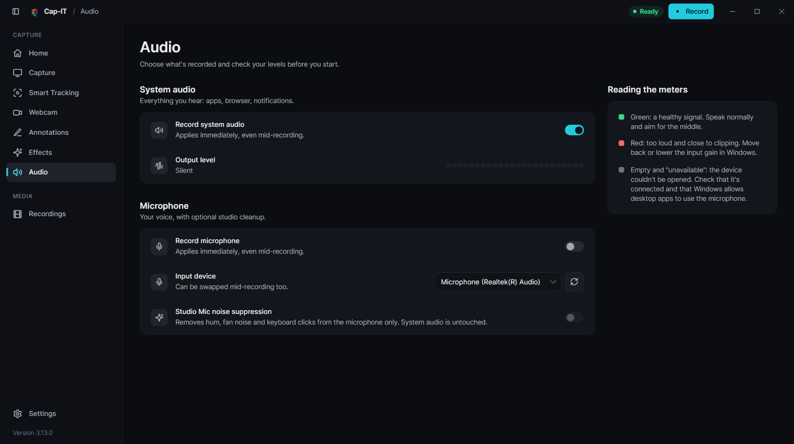
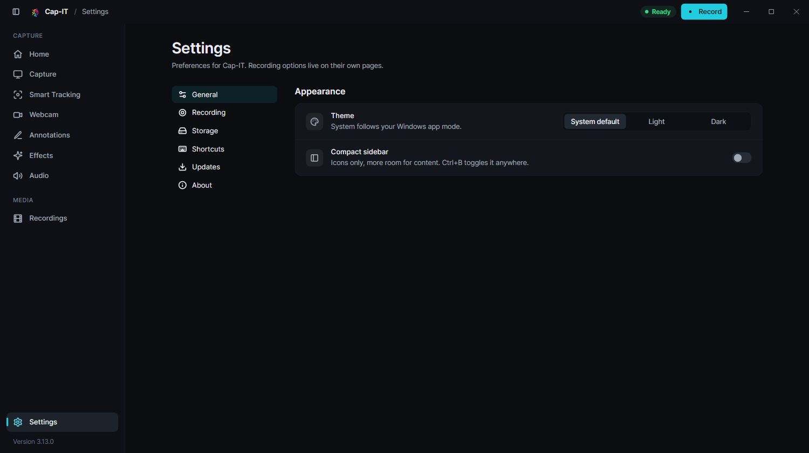
<br />
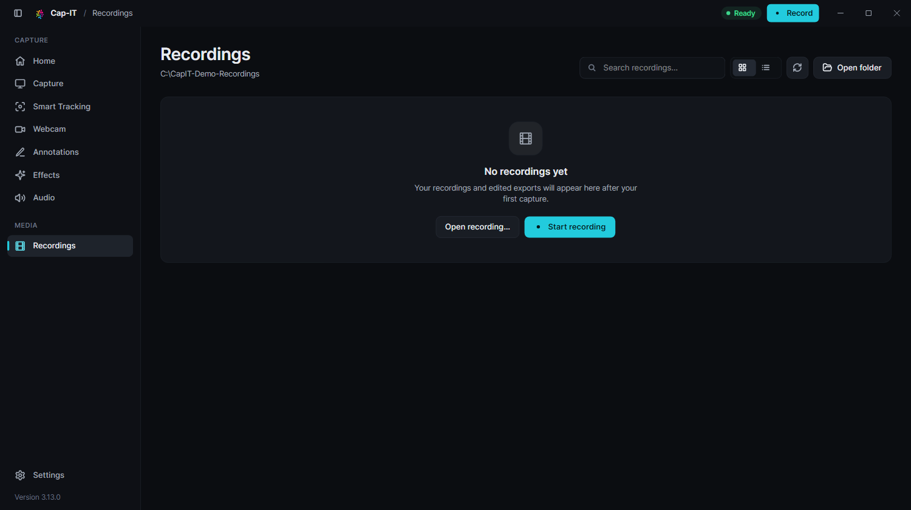
</div>

---

## Review & Export at a glance

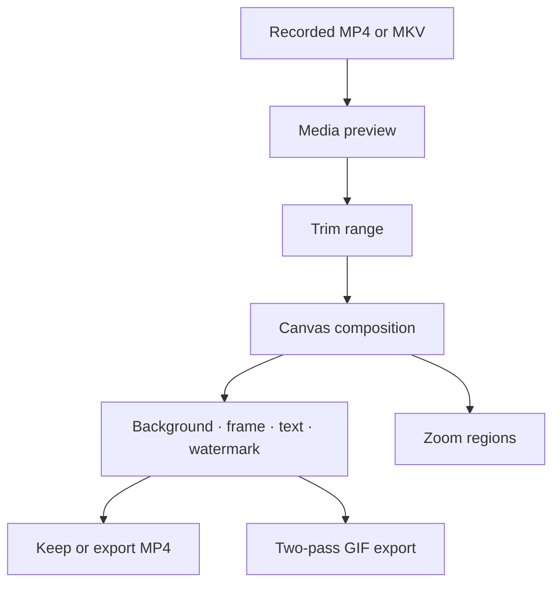
```mermaid
flowchart TB
    VIDEO[Recorded MP4 or MKV] --> PREVIEW[Media preview]
    PREVIEW --> TRIM[Trim range]
    TRIM --> COMPOSE[Canvas composition]
    COMPOSE --> STYLE[Background · frame · text · watermark]
    STYLE --> MP4[Keep or export MP4]
    STYLE --> GIF[Two-pass GIF export]
    COMPOSE --> ZOOM[Zoom regions]
```

The editor keeps the original recording safe while presentation metadata lives beside the video in a
dedicated `Cap-IT Metadata` folder. Older sidecar files remain readable for compatibility.

---

## Installation

Download **`CapIT-Screen-Recorder-Setup-3.14.0.exe`** from
the [v3.14.0 GitHub Release](https://github.com/ChamathDilshanC/Cap-IT-Screen-Recorder/releases/tag/v3.14.0)
and run it. The installer is self-contained: no separate .NET runtime, Windows App SDK runtime, or
manual FFmpeg setup is required.

> **Requirements:** Windows 10 version 2004 (build 19041) or later, 64-bit. Windows 11 recommended.

The installer adds Cap-IT to the Start Menu and supports an optional desktop shortcut. Uninstalling
does not remove your recordings.

### Updating

Cap-IT checks GitHub Releases on startup and while the app is open. When a new release is available,
**Update now** downloads the installer, waits for the running app to close, installs the update, and
relaunches Cap-IT.

---

## Quick start

1. Open **Choose source** and select a display or window.
2. Check system audio and microphone levels on **Audio**.
3. Enable **Smart Tracking**, **Webcam**, **Effects**, or **Annotations** as needed.
   In **Effects**, you can enable click sounds, choose one of four bundled effects, and adjust the volume.
4. Press **Start Recording**.
5. Stop recording to open **Review & Export**.
6. Trim, compose, add text or frames, then keep the MP4 or export a GIF.

### Organized media folders

Cap-IT keeps source recordings and edited exports separate under the configured output directory:

```text
Cap-IT Recordings/
├── Recordings/
│   └── 2026-10-03/Recording_2026-10-03_00-01-03-123.mp4
└── Edited/
    └── 2026-10-03/Recording_2026-10-03_00-01-03-123_edited_2026-10-03_00-05-44-456.mp4
```

Both the date folder and timestamped filename are created automatically. Edited MP4 and GIF exports
use the same `Edited/<date>` folder.

---

## Keyboard shortcuts

In Cap-IT: <kbd>Ctrl</kbd> + <kbd>,</kbd> settings · <kbd>Ctrl</kbd> + <kbd>O</kbd> open a recording ·
<kbd>Ctrl</kbd> + <kbd>B</kbd> toggle the sidebar. In Review & Export: <kbd>Space</kbd> play/pause ·
<kbd>Ctrl</kbd> + <kbd>E</kbd> export · <kbd>Ctrl</kbd> + <kbd>Z</kbd> / <kbd>Y</kbd> undo/redo ·
<kbd>F11</kbd> full-screen preview · <kbd>I</kbd> / <kbd>O</kbd> set trim in/out at the playhead.

These global shortcuts are available while Annotations is enabled:

| Shortcut | Action |
|---|---|
| <kbd>Ctrl</kbd> + <kbd>Shift</kbd> + <kbd>D</kbd> | Toggle drawing mode |
| <kbd>Ctrl</kbd> + <kbd>Shift</kbd> + <kbd>Z</kbd> | Undo the last stroke |
| Hold <kbd>Shift</kbd> | Constrain rectangles and circles |
| Hold <kbd>Alt</kbd> | Resize a shape from its center |
| <kbd>Ctrl</kbd> + <kbd>D</kbd> | Duplicate the selected annotation |
| <kbd>Esc</kbd> | Clear all drawings |

---

## Architecture

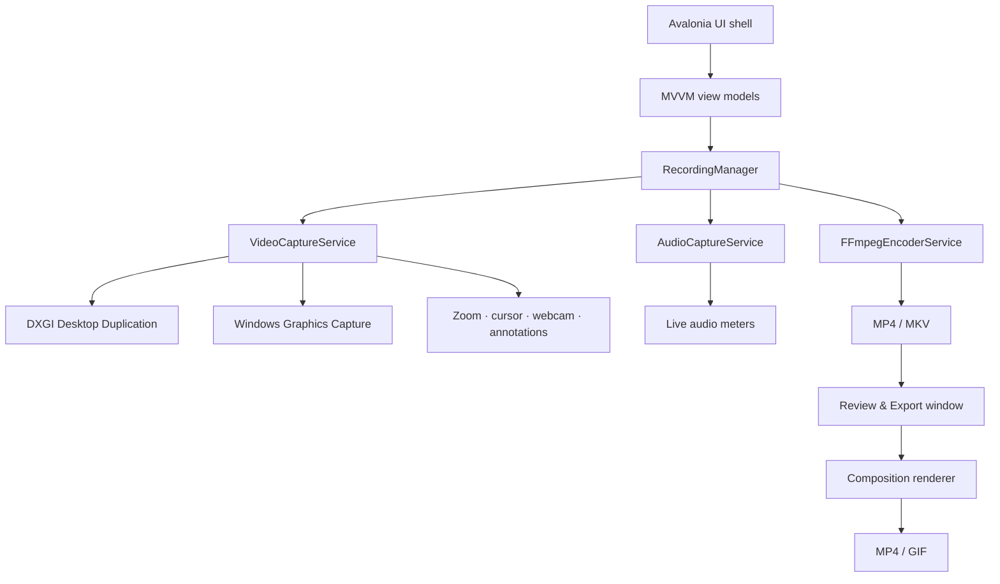
```mermaid
flowchart TB
    SHELL[Avalonia UI shell] --> VM[MVVM view models]
    VM --> MANAGER[RecordingManager]
    MANAGER --> CAPTURE[VideoCaptureService]
    MANAGER --> AUDIO[AudioCaptureService]
    MANAGER --> ENCODER[FFmpegEncoderService]
    CAPTURE --> DXGI[DXGI Desktop Duplication]
    CAPTURE --> WGC[Windows Graphics Capture]
    CAPTURE --> EFFECTS[Zoom · cursor · webcam · annotations]
    AUDIO --> METERS[Live audio meters]
    ENCODER --> FILE[MP4 / MKV]
    FILE --> REVIEW[Review & Export window]
    REVIEW --> COMPOSITION[Composition renderer]
    COMPOSITION --> EXPORT[MP4 / GIF]
```

### Project map

| Area | Location |
|---|---|
| Avalonia app: shell, pages, editor | [`src/CapIT.Desktop/Views/`](src/CapIT.Desktop/Views/) |
| Design system (tokens, colours, controls) | [`src/CapIT.Desktop/Styles/`](src/CapIT.Desktop/Styles/), [`src/CapIT.Desktop/Controls/`](src/CapIT.Desktop/Controls/) |
| MVVM state and commands | [`src/CapIT.Desktop/ViewModels/`](src/CapIT.Desktop/ViewModels/) |
| Capture, audio, encoding, hooks, overlays | [`src/CapIT.Infrastructure.Windows/Services/`](src/CapIT.Infrastructure.Windows/Services/) |
| Composition and exports | [`src/CapIT.Core/Services/Export/`](src/CapIT.Core/Services/Export/) |
| Domain settings and metadata | [`src/CapIT.Core/Models/`](src/CapIT.Core/Models/) |
| Regression checks | [`Tests/CompositionChecks/`](Tests/CompositionChecks/) |
| Real-recording checks (timeline, audio tail, A/V sync, zoom sharpness, caret following) | [`Tests/RecordingChecks/`](Tests/RecordingChecks/) |
| Brand identity: book, guidelines, tokens, assets | [`brand/`](brand/), [`Cap-IT-Brand-Book.pdf`](Cap-IT-Brand-Book.pdf) |
| Recording-quality report | [`docs/SMART-TRACKING-RECORDING-FIX.md`](docs/SMART-TRACKING-RECORDING-FIX.md) |
| Release automation | [`.github/workflows/`](.github/workflows/) |

The UI migration and architecture are described in [`docs/AVALONIA-MIGRATION.md`](docs/AVALONIA-MIGRATION.md).

---

## Build from source

```powershell
dotnet restore CapIT.sln
dotnet build CapIT.sln --no-restore
dotnet run --project src\CapIT.Desktop\CapIT.Desktop.csproj
dotnet run --project Tests\CompositionChecks\CompositionChecks.csproj --no-restore
```

Release builds publish a self-contained `ScreenRecorderApp.exe`:

```powershell
dotnet publish src\CapIT.Desktop\CapIT.Desktop.csproj -c Release -r win-x64 --self-contained true -o publish
```

Place `ffmpeg.exe` in `ffmpeg/` to bundle it (see [`ffmpeg/README.md`](ffmpeg/README.md)); otherwise
Cap-IT offers to download it on first use.

The composition checks validate geometry, metadata compatibility, MP4 output, GIF output, and the
shared preview/export rendering path.

---

## Brand identity

The Cap-IT brand book covers the dark and light themes, logo usage, colour, typography, components and
templates. Read the **[Cap-IT Brand Book (PDF, 68 pages)](Cap-IT-Brand-Book.pdf)**, or work from the sources in
[`brand/`](brand/): [guidelines](brand/Cap-IT-Brand-Guidelines.md), [brand tokens](brand/Cap-IT-Brand-Tokens.json),
[dark theme](brand/Cap-IT-Dark-Theme.json), [light theme](brand/Cap-IT-Light-Theme.json) and the
[asset pack](brand/Cap-IT-Brand-Assets/).

---

## Technical foundation

- **C# / .NET 8** and **Avalonia UI 11** (Fluent base, custom Cap-IT design system, Inter)
- **CommunityToolkit.Mvvm** and **Microsoft.Extensions.DependencyInjection**
- **DXGI Desktop Duplication** and **Windows Graphics Capture**
- **Vortice.Direct3D11 / Vortice.DXGI**
- **NAudio** WASAPI loopback and microphone capture
- **FFmpeg** named-pipe recording and two-pass GIF export
- **GDI / GDI+** source thumbnails and annotation overlay
- **Media Foundation** (`MediaPlayer` frame server) for editor playback
- Raw Win32 hooks for global input and capture coordination

---

## Release history

| Version | Highlights |
|---|---|
| [v3.14.0](https://github.com/ChamathDilshanC/Cap-IT-Screen-Recorder/releases/tag/v3.14.0) | Gap-free Smart Tracking recording timeline, audio that ends with the video, sharper zoomed text, steadier window capture, and the Cap-IT brand book |
| [v3.13.1](https://github.com/ChamathDilshanC/Cap-IT-Screen-Recorder/releases/tag/v3.13.1) | Smoother Smart Tracking motion and sharper live preview scaling |
| [v3.13.0](https://github.com/ChamathDilshanC/Cap-IT-Screen-Recorder/releases/tag/v3.13.0) | Avalonia desktop interface, recordings library, refreshed review workspace, and versioned screenshots |
| [v3.7.0](https://github.com/ChamathDilshanC/Cap-IT-Screen-Recorder/releases/tag/v3.7.0) | Configurable click sounds with four selectable effects, volume control, and bundled WAV/MP3 assets |
| [v3.6.0](https://github.com/ChamathDilshanC/Cap-IT-Screen-Recorder/releases/tag/v3.6.0) | Smart Tracking instant zoom-out, adjustable animation speed, live propagation, and preset persistence |
| [v3.5.0](https://github.com/ChamathDilshanC/Cap-IT-Screen-Recorder/releases/tag/v3.5.0) | Multiple text layers, alignment, colors, opacity, bounce-letter animation, and Safari-style browser frame |
| [v3.4.3](https://github.com/ChamathDilshanC/Cap-IT-Screen-Recorder/releases/tag/v3.4.3) | Responsive text dragging and review-canvas interaction |

---

## Author

Designed and developed by **[ChamathDilshanC](https://github.com/ChamathDilshanC)**.

## Feedback and contributing

Found a bug or have an idea? Open a
[GitHub issue](https://github.com/ChamathDilshanC/Cap-IT-Screen-Recorder/issues) with your Windows
version, capture target, and a short reproduction. Pull requests are welcome for focused improvements
that preserve the native Windows workflow.

## License

See [`LICENSE`](LICENSE) for the project license.
