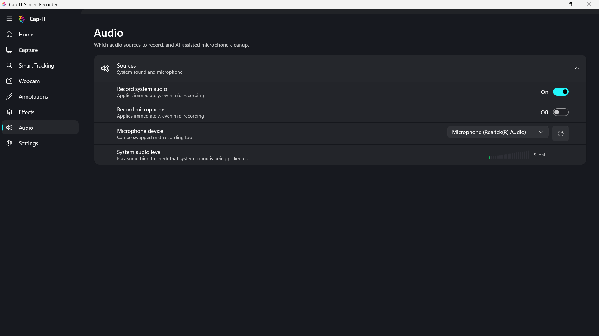
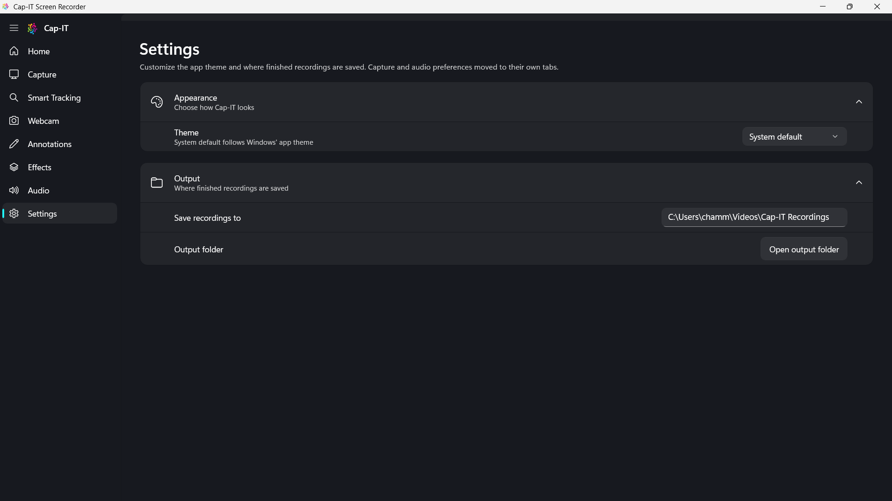
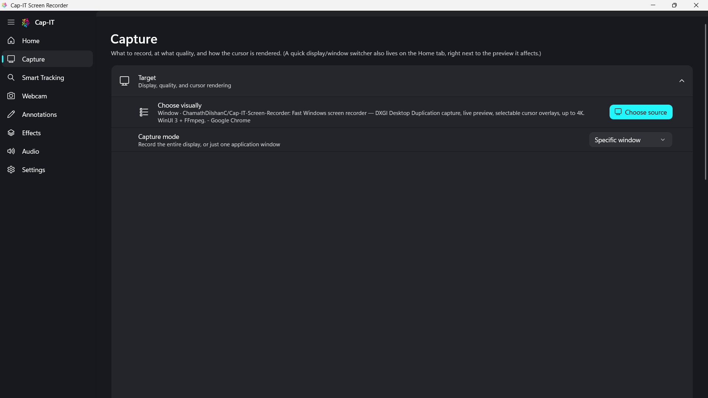

# Cap-IT Screen Recorder screenshot gallery

This folder contains the latest full-window application screenshots captured at **1920 × 1080**.

## Main application screens

| Screen | Screenshot |
|---|---|
| Home |  |
| Capture |  |
| Smart Tracking |  |
| Webcam |  |
| Annotations |  |
| Effects |  |
| Audio |  |
| Settings |  |
| Review & Export |  |

## Feature highlights

| Feature | Screenshot |
|---|---|
| Smart Tracking enabled |  |
| Cursor effects enabled |  |
| Source picker and window capture |  |
| Capture options |  |

All images are native captures of the running WinUI application, including the Windows title bar and full 1920 × 1080 desktop viewport.
