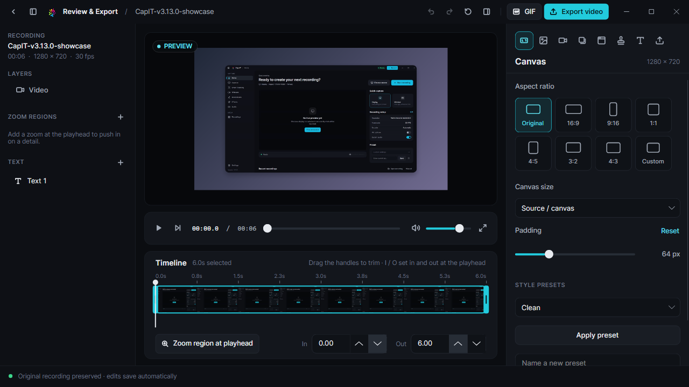
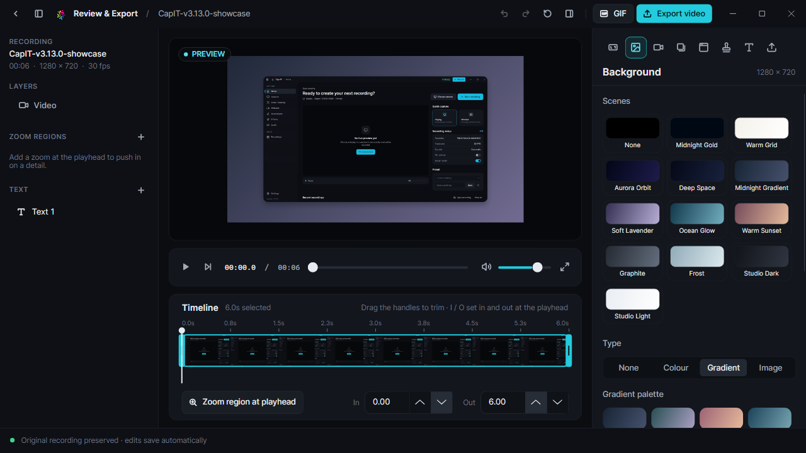
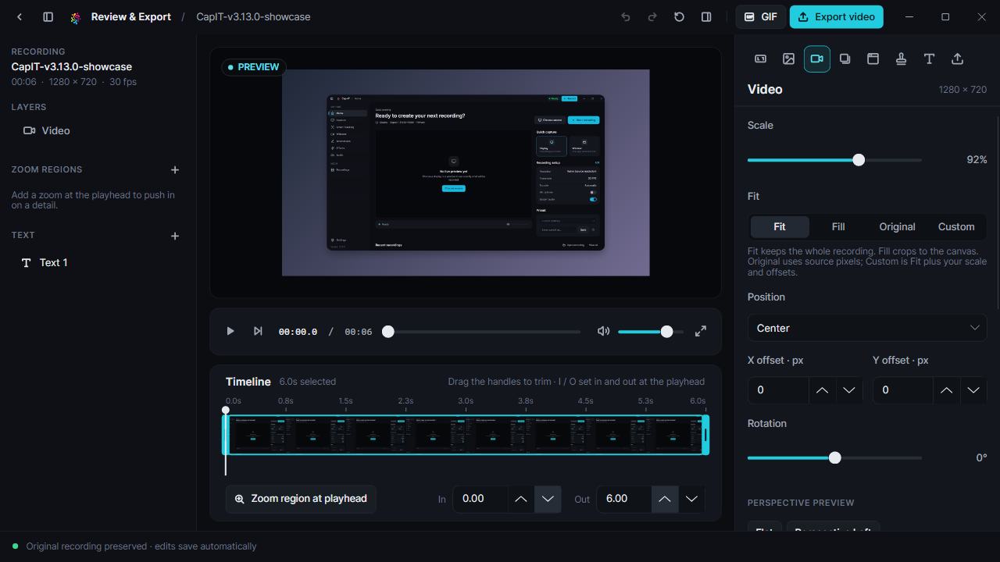
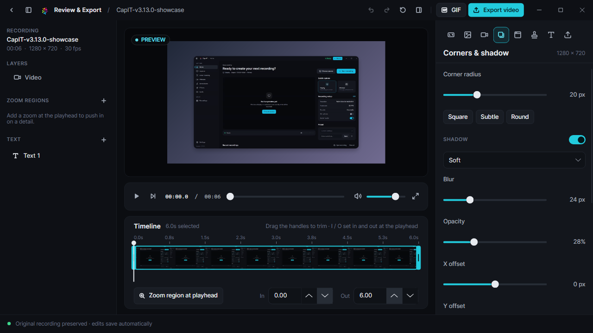
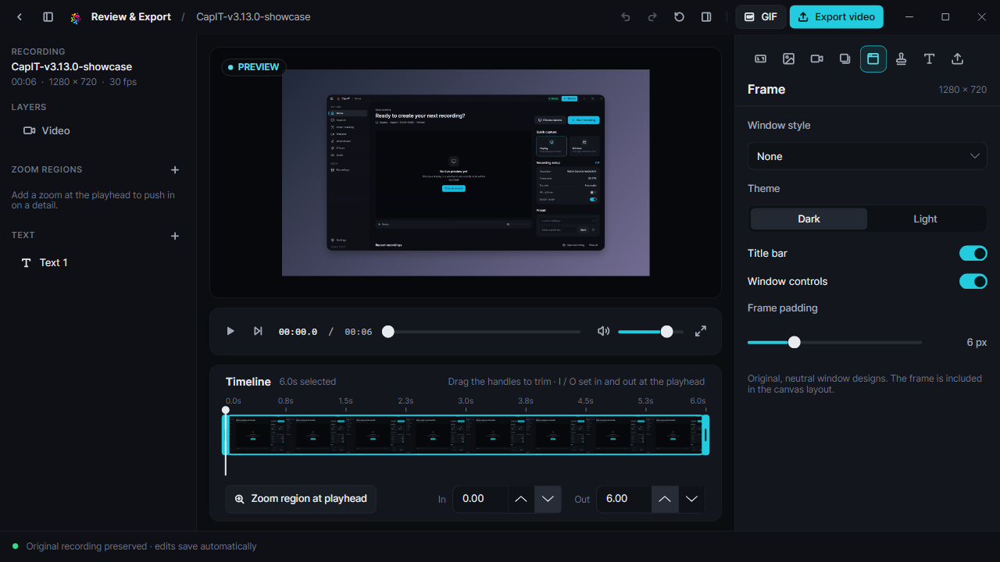
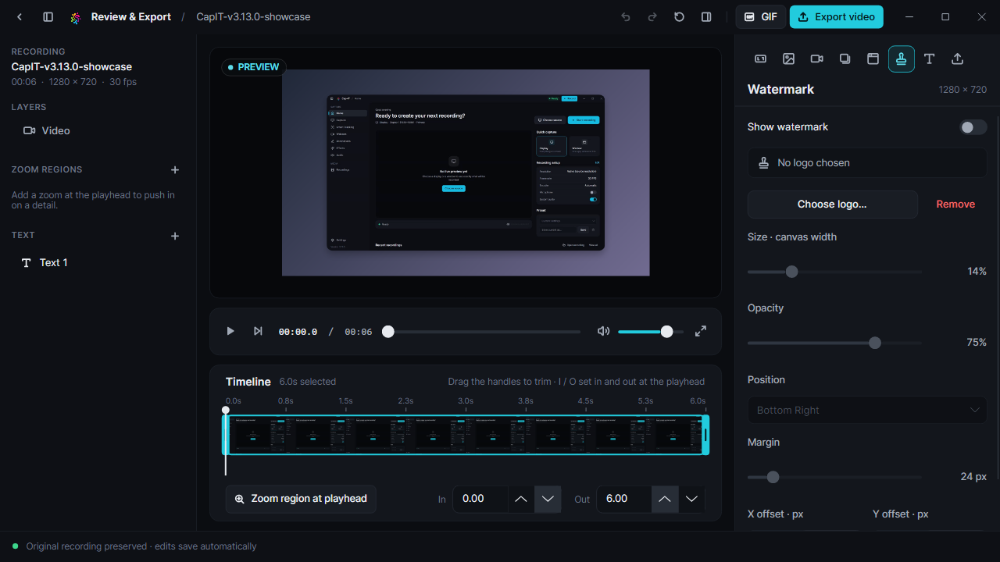
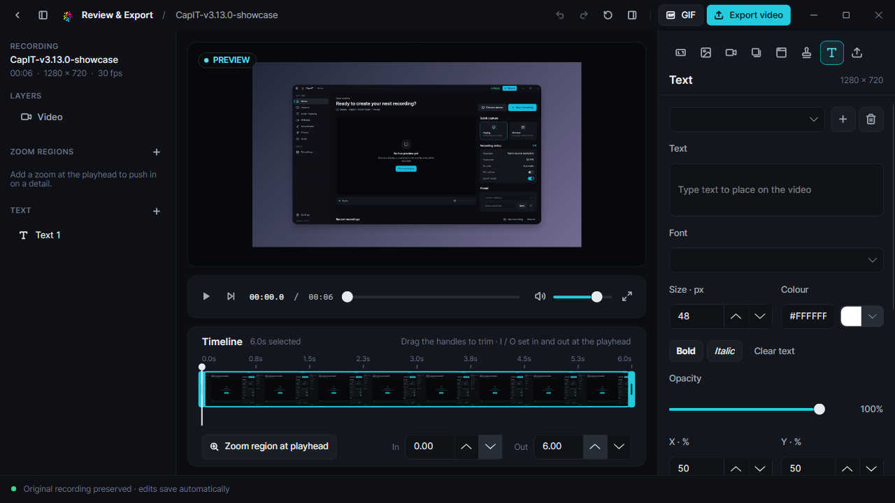
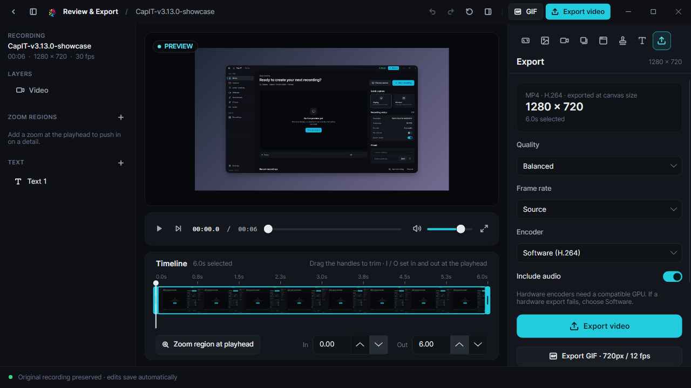

# Cap-IT Screen Recorder v3.13.0

Screenshots of the Avalonia desktop interface, captured from the v3.13.0 build.

## Main application

| Screen | Preview |
|---|---|
| Home |  |
| Capture |  |
| Smart Tracking |  |
| Webcam |  |
| Annotations |  |
| Effects |  |
| Audio |  |
| Recordings |  |
| Settings |  |
| Review & Export |  |

## Review & Export tools

| Tool | Preview |
|---|---|
| Canvas and aspect ratios |  |
| Backgrounds |  |
| Trim and zoom regions |  |
| Corners and shadows |  |
| Device frames |  |
| Watermarks |  |
| Text layers |  |
| MP4 and GIF export |  |

Earlier screenshots are archived at [`../v3.6.0/`](../v3.6.0/).
